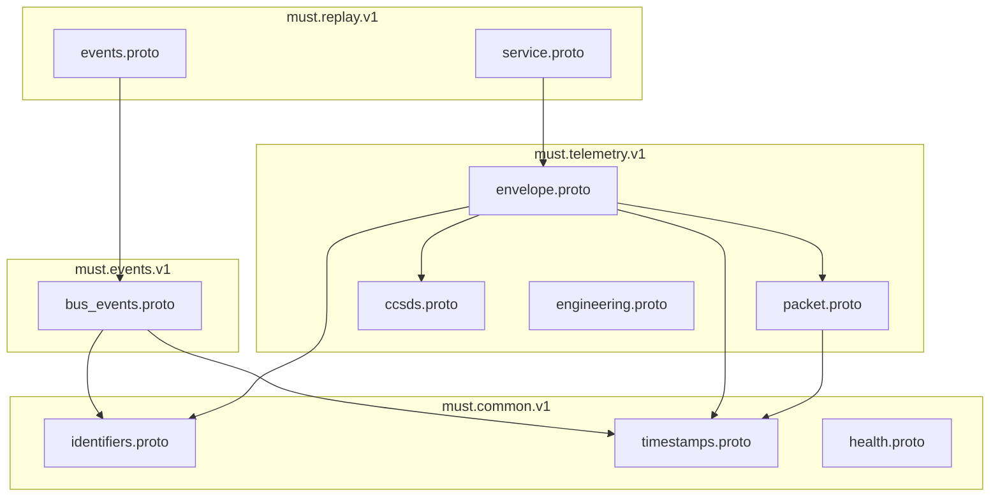

# MuST — Shared Contracts Specification

| Field              | Value                                    |
|--------------------|------------------------------------------|
| **Document ID**    | MUST-CONTRACTS-002                       |
| **Version**        | 1.0.0-DRAFT                             |
| **Date**           | 2026-07-03                               |
| **Status**         | DRAFT — PENDING REVIEW                   |
| **Standards**      | CCSDS 133.0-B-2, ECSS-E-ST-70-41C       |

---

## 1. Purpose

This document defines the **shared data contracts** used by every service in the MuST pipeline. These contracts are the single source of truth for inter-service communication. No service may define its own packet format.

**Why shared contracts matter:**

Without them, each service invents its own telemetry representation. Service A calls it `timestamp`. Service B calls it `packet_time`. Service C uses milliseconds, Service D uses nanoseconds. Integration becomes a translation nightmare. Shared contracts eliminate this class of bugs at the schema level.

**Repository location:**

```
Decode/
├── shared/
│   └── proto/
│       ├── must/
│       │   ├── common/
│       │   │   └── v1/
│       │   │       ├── identifiers.proto    # Mission, satellite, ground station IDs
│       │   │       ├── timestamps.proto     # Timestamp types
│       │   │       └── health.proto         # Health/status enums
│       │   ├── telemetry/
│       │   │   └── v1/
│       │   │       ├── packet.proto         # Raw telemetry packet
│       │   │       ├── envelope.proto       # Routable telemetry envelope
│       │   │       ├── ccsds.proto          # CCSDS-specific structures
│       │   │       └── engineering.proto    # Decoded engineering values
│       │   ├── replay/
│       │   │   └── v1/
│       │   │       ├── service.proto        # Replay control RPCs
│       │   │       └── events.proto         # Replay events
│       │   └── events/
│       │       └── v1/
│       │           └── bus_events.proto     # Platform-wide event envelope
│       └── buf.yaml                         # Buf schema registry config
```

**Why this structure:**
- `must/` namespace prevents collisions with third-party protos.
- `v1/` versioning enables non-breaking evolution. When v2 is needed, both coexist.
- Domain separation (`common/`, `telemetry/`, `replay/`, `events/`) prevents circular dependencies.
- `buf.yaml` enables schema linting, breaking change detection, and code generation.

---

## 2. Common Types

### 2.1 Identifiers (`identifiers.proto`)

```protobuf
syntax = "proto3";
package must.common.v1;

// MissionIdentifier uniquely identifies a space mission.
// Why a message, not a string: structured IDs enable type-safe routing
// and prevent typo-based misrouting (e.g., "ISRO-CY3" vs "isro_cy3").
message MissionIdentifier {
  uint32 mission_id = 1;       // Numeric ID (internal, for routing)
  string mission_name = 2;     // Human-readable (e.g., "Chandrayaan-3")
  string mission_code = 3;     // Short code (e.g., "CY3")
}

// SatelliteIdentifier uniquely identifies a satellite within a mission.
message SatelliteIdentifier {
  uint32 satellite_id = 1;     // Numeric ID
  string satellite_name = 2;   // Human-readable (e.g., "Propulsion Module")
  uint32 norad_id = 3;         // NORAD catalog number (for TLE correlation)
}

// GroundStationIdentifier identifies the receiving ground station.
// Why include this: multi-station tracking means the same satellite
// may be received by different stations simultaneously.
message GroundStationIdentifier {
  uint32 station_id = 1;
  string station_name = 2;     // e.g., "ISTRAC-Bangalore", "DSN-Goldstone"
  string station_code = 3;     // e.g., "ISTRAC-BLR"
}

// SourceIdentifier identifies the telemetry source.
// This is what the Replay Simulator uses as its identity.
// A live receiver would provide a different source type.
message SourceIdentifier {
  string source_id = 1;        // Unique instance ID (UUID)
  SourceType source_type = 2;
  string source_name = 3;      // Human-readable (e.g., "replay-sim-01")
}

enum SourceType {
  SOURCE_TYPE_UNSPECIFIED = 0;
  SOURCE_TYPE_REPLAY = 1;      // File replay
  SOURCE_TYPE_TCP = 2;         // Live TCP receiver
  SOURCE_TYPE_UDP = 3;         // Live UDP receiver
  SOURCE_TYPE_SDR = 4;         // Software-defined radio
  SOURCE_TYPE_SERIAL = 5;      // Serial port
  SOURCE_TYPE_GNU_RADIO = 6;   // GNU Radio flowgraph
}
```

### 2.2 Timestamps (`timestamps.proto`)

```protobuf
syntax = "proto3";
package must.common.v1;

// MustTimestamp is the platform-wide timestamp type.
// Why nanoseconds: CCSDS CUC timestamps have sub-microsecond resolution.
// Why epoch-based: enables arithmetic without calendar complexity.
// Why separate message: carries metadata about the clock source.
message MustTimestamp {
  uint64 nanos_since_epoch = 1;    // Nanoseconds since Unix epoch (1970-01-01T00:00:00Z)
  TimestampSource source = 2;      // Where this timestamp came from
}

enum TimestampSource {
  TIMESTAMP_SOURCE_UNSPECIFIED = 0;
  TIMESTAMP_SOURCE_ONBOARD = 1;     // Satellite onboard clock (from CCSDS secondary header)
  TIMESTAMP_SOURCE_GROUND = 2;      // Ground station reception time
  TIMESTAMP_SOURCE_REPLAY = 3;      // Replay simulator clock
  TIMESTAMP_SOURCE_SYSTEM = 4;      // System wall clock (least precise)
}
```

**Design Rationale for nanoseconds:**

| Alternative | Why Rejected |
|-------------|-------------|
| Milliseconds | Insufficient resolution. CCSDS CUC can express ~15 ns granularity. Truncating to ms loses information. |
| Microseconds | Sufficient for most use cases but not future-proof. ISRO's upcoming deep-space missions require ns-level correlation. |
| google.protobuf.Timestamp | Uses seconds + nanos (two fields). Arithmetic requires combining fields. Single uint64 is simpler for routing key construction and comparison. |

---

## 3. Telemetry Packet Schema

### 3.1 Raw Telemetry Packet (`packet.proto`)

```protobuf
syntax = "proto3";
package must.telemetry.v1;

import "must/common/v1/timestamps.proto";

// RawTelemetryPacket represents a single packet as received.
// This is the lowest-level representation — no decode, no interpretation.
// Every byte from the wire (or file) is preserved in `data`.
message RawTelemetryPacket {
  bytes data = 1;                              // Complete packet bytes (including headers)
  uint32 data_length = 2;                      // Redundant with data.len(), but explicit for wire efficiency
  must.common.v1.MustTimestamp receive_time = 3; // When the packet was received (or replayed)
  uint64 file_offset = 4;                      // Byte offset in source file (0 for live)
}
```

### 3.2 CCSDS Structures (`ccsds.proto`)

```protobuf
syntax = "proto3";
package must.telemetry.v1;

// CcsdsPacketHeader represents the 6-byte CCSDS Space Packet primary header.
// Parsed from the raw bytes. Every field maps 1:1 to CCSDS 133.0-B-2 Section 4.1.
//
// Why parse the header into fields: downstream services need to route by APID,
// filter by type, and validate sequence counts. Asking every service to
// parse 6 bytes of bit-packed header is error-prone and wasteful.
message CcsdsPacketHeader {
  // Packet Identification
  uint32 version_number = 1;        // 3 bits. Always 0b000 for Space Packet.
  PacketType packet_type = 2;       // 1 bit. TM (0) or TC (1).
  bool secondary_header_flag = 3;   // 1 bit. True if secondary header present.
  uint32 apid = 4;                  // 11 bits. Application Process Identifier.
  
  // Packet Sequence Control
  SequenceFlags sequence_flags = 5; // 2 bits. Segmentation flags.
  uint32 sequence_count = 6;        // 14 bits. Monotonic per-APID counter.
  
  // Packet Data Length
  uint32 data_length = 7;           // 16 bits. (Number of octets in data field) - 1.
}

enum PacketType {
  PACKET_TYPE_UNSPECIFIED = 0;
  PACKET_TYPE_TM = 1;              // Telemetry
  PACKET_TYPE_TC = 2;              // Telecommand
}

enum SequenceFlags {
  SEQUENCE_FLAGS_UNSPECIFIED = 0;
  SEQUENCE_FLAGS_CONTINUATION = 1; // Middle segment
  SEQUENCE_FLAGS_FIRST = 2;        // First segment
  SEQUENCE_FLAGS_LAST = 3;         // Last segment
  SEQUENCE_FLAGS_STANDALONE = 4;   // Unsegmented (complete packet)
}

// CcsdsSecondaryHeader represents the time-code field in the secondary header.
// Format varies by mission. This captures the common case (CCSDS CUC).
message CcsdsSecondaryHeader {
  uint64 coarse_time = 1;          // Seconds since epoch (mission-specific epoch)
  uint32 fine_time = 2;            // Sub-second fraction
  TimeCodeFormat format = 3;       // How to interpret coarse/fine
}

enum TimeCodeFormat {
  TIME_CODE_FORMAT_UNSPECIFIED = 0;
  TIME_CODE_FORMAT_CUC = 1;        // CCSDS Unsegmented Time Code
  TIME_CODE_FORMAT_CDS = 2;        // CCSDS Day Segmented Time Code
  TIME_CODE_FORMAT_EPOCH_NS = 3;   // Direct nanoseconds (non-standard, for binary files)
}
```

### 3.3 Telemetry Envelope (`envelope.proto`)

This is the **central contract** of the entire MuST system. Every service publishes and consumes this message.

```protobuf
syntax = "proto3";
package must.telemetry.v1;

import "must/common/v1/identifiers.proto";
import "must/common/v1/timestamps.proto";
import "must/telemetry/v1/packet.proto";
import "must/telemetry/v1/ccsds.proto";

// TelemetryEnvelope is the universal telemetry container.
// 
// EVERY message on the telemetry bus is a TelemetryEnvelope.
// 
// Why an envelope and not just the raw packet:
// 1. Routing: RabbitMQ routing keys are built from envelope fields
//    (mission_id, satellite_id, apid, processing_stage).
// 2. Traceability: Every envelope carries its full lineage —
//    which source produced it, when, what sequence number.
// 3. Progressive enrichment: As a packet flows through the pipeline,
//    fields are added (CCSDS header, engineering values) without
//    modifying earlier fields.
//
// Immutability rule: Once a field is set by a producing service,
// no downstream service may modify it. Services may only ADD fields
// to their processing stage.
message TelemetryEnvelope {
  // === Identity ===
  string envelope_id = 1;                         // UUID, unique per envelope instance
  uint64 sequence_number = 2;                      // Monotonic per-source counter

  // === Source ===
  must.common.v1.SourceIdentifier source = 3;      // Who produced this envelope
  must.common.v1.GroundStationIdentifier station = 4; // Which station received it (or simulated)

  // === Mission Context ===
  must.common.v1.MissionIdentifier mission = 5;    // Which mission
  must.common.v1.SatelliteIdentifier satellite = 6; // Which satellite

  // === Timestamps ===
  must.common.v1.MustTimestamp original_timestamp = 7;  // From the recording / onboard clock
  must.common.v1.MustTimestamp receive_timestamp = 8;   // When received / replayed
  must.common.v1.MustTimestamp publish_timestamp = 9;   // When published to the bus

  // === Packet Data ===
  RawTelemetryPacket raw_packet = 10;              // The raw bytes (always present)
  CcsdsPacketHeader ccsds_header = 11;             // Parsed CCSDS header (set by CCSDS service)
  CcsdsSecondaryHeader ccsds_secondary = 12;       // Parsed secondary header (if present)

  // === CCSDS Routing Fields (denormalized for RabbitMQ routing) ===
  uint32 apid = 13;                                // Copied from ccsds_header for routing key
  uint32 vcid = 14;                                // Virtual Channel ID (from TF layer)

  // === Processing Metadata ===
  ProcessingStage stage = 15;                      // Current stage in the pipeline
  map<string, string> annotations = 16;            // Extensible key-value metadata

  // === Quality ===
  QualityIndicator quality = 17;                   // Data quality assessment
}

// ProcessingStage tracks where in the pipeline this envelope currently is.
// Why: enables per-stage metrics, routing, and debugging.
// A packet published at STAGE_RAW by the Replay Service will be
// republished at STAGE_CCSDS_DECODED by the CCSDS service.
enum ProcessingStage {
  PROCESSING_STAGE_UNSPECIFIED = 0;
  PROCESSING_STAGE_RAW = 1;              // Raw bytes from source (Replay/Receiver)
  PROCESSING_STAGE_CCSDS_DECODED = 2;    // CCSDS headers parsed (CCSDS Service)
  PROCESSING_STAGE_ENGINEERING = 3;      // Engineering values extracted (XTCE Service)
  PROCESSING_STAGE_VALIDATED = 4;        // Limits checked (Validation Service)
  PROCESSING_STAGE_ARCHIVED = 5;         // Written to storage (Archive Service)
}

// QualityIndicator flags potential issues with the packet.
message QualityIndicator {
  bool is_valid = 1;                     // Overall validity flag
  bool crc_ok = 2;                       // CRC check result (if applicable)
  bool timestamp_monotonic = 3;          // Timestamp is monotonically increasing
  bool sequence_continuous = 4;          // No gap in sequence count
  repeated string warnings = 5;          // Human-readable warning messages
}
```

### 3.4 Engineering Values (`engineering.proto`)

```protobuf
syntax = "proto3";
package must.telemetry.v1;

// EngineeringValue represents a single decoded telemetry parameter.
// Produced by the XTCE Processing Service after applying calibrations.
message EngineeringValue {
  string parameter_name = 1;       // Fully qualified name (e.g., "/SC/EPS/BattVoltage")
  string parameter_id = 2;         // Unique ID from XTCE database
  
  oneof value {
    double float_value = 3;
    int64 int_value = 4;
    string string_value = 5;
    bool bool_value = 6;
    bytes raw_value = 7;
  }
  
  string unit = 8;                 // Engineering unit (e.g., "V", "degC", "rpm")
  string calibration_name = 9;    // Which calibration was applied
  
  AlarmState alarm = 10;
}

enum AlarmState {
  ALARM_STATE_UNSPECIFIED = 0;
  ALARM_STATE_NOMINAL = 1;
  ALARM_STATE_WARNING_LOW = 2;
  ALARM_STATE_WARNING_HIGH = 3;
  ALARM_STATE_CRITICAL_LOW = 4;
  ALARM_STATE_CRITICAL_HIGH = 5;
  ALARM_STATE_STALE = 6;          // No update within expected interval
}

// EngineeringTelemetry is published on the `telemetry.engineering` topic.
// Contains all decoded parameters from a single CCSDS packet.
message EngineeringTelemetry {
  string envelope_id = 1;                // References the TelemetryEnvelope
  uint32 apid = 2;                       // Source APID
  repeated EngineeringValue values = 3;  // All decoded parameters
}
```

---

## 4. Platform Event Schema

### 4.1 Bus Events (`bus_events.proto`)

```protobuf
syntax = "proto3";
package must.events.v1;

import "must/common/v1/identifiers.proto";
import "must/common/v1/timestamps.proto";

// PlatformEvent is the envelope for all non-telemetry events on the bus.
// Service lifecycle, errors, configuration changes, operator actions.
message PlatformEvent {
  string event_id = 1;                            // UUID
  must.common.v1.MustTimestamp timestamp = 2;
  must.common.v1.SourceIdentifier source = 3;     // Which service emitted this
  
  EventSeverity severity = 4;
  string event_type = 5;                           // Dot-notation (e.g., "replay.playback.started")
  string message = 6;                             // Human-readable
  map<string, string> metadata = 7;               // Structured context
}

enum EventSeverity {
  EVENT_SEVERITY_UNSPECIFIED = 0;
  EVENT_SEVERITY_INFO = 1;
  EVENT_SEVERITY_WARNING = 2;
  EVENT_SEVERITY_ERROR = 3;
  EVENT_SEVERITY_CRITICAL = 4;
}
```

---

## 5. Contract Rules

These rules are **mandatory** for all MuST services.

### 5.1 Immutability

Once a field in `TelemetryEnvelope` is set by a producing service, no downstream service may modify it. Services may only populate fields that are unset.

**Why:** If the CCSDS Service could overwrite `original_timestamp` set by the Replay Service, debugging becomes impossible. Each field has a single writer.

| Field | Writer | Readers |
|-------|--------|---------|
| envelope_id | First producer (Replay/Receiver) | All |
| sequence_number | First producer | All |
| source | First producer | All |
| mission, satellite | First producer or Gateway | All |
| original_timestamp | First producer | All |
| receive_timestamp | First producer | All |
| publish_timestamp | Current publisher (overwritten per hop) | All |
| raw_packet | First producer | All |
| ccsds_header | CCSDS Service | XTCE, Validation, Archive |
| apid, vcid | CCSDS Service (or Replay if pre-parsed) | Routing, XTCE |
| stage | Current processor | Routing, Monitoring |
| quality | Each processor (additive) | All |

### 5.2 Versioning

- Proto packages use `v1` suffix.
- Fields may be ADDED to existing messages (backward compatible).
- Fields may NEVER be removed or renumbered (forward compatible).
- When a breaking change is needed, create `v2` package. Both coexist until migration is complete.

### 5.3 Naming Conventions

| Element | Convention | Example |
|---------|-----------|---------|
| Package | `must.{domain}.v{N}` | `must.telemetry.v1` |
| Message | PascalCase | `TelemetryEnvelope` |
| Field | snake_case | `sequence_number` |
| Enum | SCREAMING_SNAKE_CASE | `PACKET_TYPE_TM` |
| Enum zero value | `{TYPE}_UNSPECIFIED` | `PROCESSING_STAGE_UNSPECIFIED` |
| RPC | PascalCase verb | `LoadFile`, `StreamTelemetry` |

### 5.4 Code Generation

Every service generates language-specific bindings from these protos:

```bash
# Rust (using tonic-build)
# Go (using protoc-gen-go)
# Python (using grpcio-tools, for test scripts)
# TypeScript (using ts-proto, for dashboards)
```

Services MUST NOT hand-write structures that duplicate proto-generated types.

---

## 6. Schema Dependency Graph



**Rule:** Dependencies flow downward. `common` depends on nothing. `telemetry` depends on `common`. Domain services depend on `telemetry` and `common`. No circular dependencies.

---

## 7. Revision History

| Version | Date       | Description |
|---------|------------|-------------|
| 1.0.0   | 2026-07-03 | Initial draft — core contracts |
