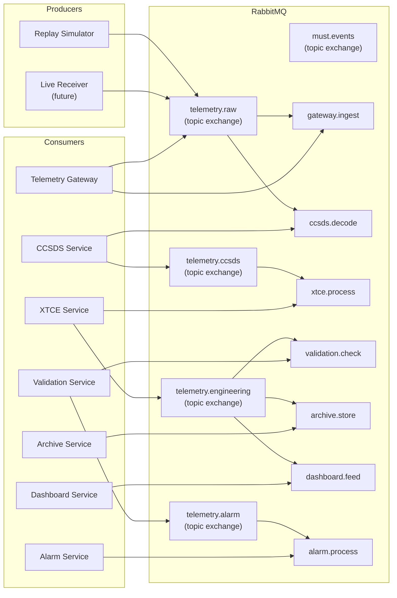

# MuST — Message Bus Design

| Field              | Value                                    |
|--------------------|------------------------------------------|
| **Document ID**    | MUST-BUS-003                             |
| **Version**        | 1.0.0-DRAFT                             |
| **Date**           | 2026-07-03                               |
| **Status**         | DRAFT — PENDING REVIEW                   |
| **Decision Ref**   | ADR-001, ADR-006                         |

---

## 1. Purpose

This document defines the RabbitMQ message bus topology for the entire MuST platform. It specifies exchanges, queues, routing keys, binding patterns, and message flow for every service.

**Why this document exists:**
Without a formal bus design, each service team creates ad-hoc queues and exchanges. You end up with `telemetry_queue_v2_final_FIXED`, undocumented routing keys, and cross-service coupling via shared queue names. This document is the bus schema — as critical as the database schema.

---

## 2. RabbitMQ Topology Overview



---

## 3. Exchange Definitions

All exchanges use the **topic** type. Topic exchanges enable flexible routing via dot-notation routing keys with wildcard binding patterns.

**Why topic (not direct, not fanout):**
- **Direct** requires exact key matching. Cannot do "all packets from mission X."
- **Fanout** broadcasts to all bound queues. Cannot filter.
- **Topic** supports hierarchical routing: `mission.satellite.apid.stage` with `*` (one word) and `#` (zero or more words) wildcards.

| Exchange | Type | Durable | Description |
|----------|------|---------|-------------|
| `telemetry.raw` | topic | yes | Raw telemetry packets from sources (Replay, Receiver) |
| `telemetry.ccsds` | topic | yes | CCSDS-decoded packets (headers parsed) |
| `telemetry.engineering` | topic | yes | Engineering-valued packets (parameters extracted) |
| `telemetry.alarm` | topic | yes | Out-of-limit / alarm notifications |
| `telemetry.validated` | topic | yes | Limit-checked, quality-assessed packets |
| `must.events` | topic | yes | Platform events (non-telemetry: lifecycle, errors, status) |

**Why durable:** Exchanges survive RabbitMQ restarts. Without durability, a RabbitMQ restart requires all services to re-declare their exchanges — a coordination nightmare in production.

---

## 4. Routing Key Schema

### 4.1 Telemetry Routing Key Format

```
{mission_code}.{satellite_id}.{apid}.{stage}
```

| Segment | Example | Source |
|---------|---------|--------|
| mission_code | `cy3` | MissionIdentifier.mission_code (lowercase) |
| satellite_id | `sat01` | SatelliteIdentifier.satellite_id (prefixed) |
| apid | `0064` | APID zero-padded to 4 digits |
| stage | `raw` | ProcessingStage name (lowercase) |

**Examples:**
```
cy3.sat01.0064.raw              # Chandrayaan-3, Satellite 01, APID 64, raw stage
cy3.sat01.0064.ccsds_decoded    # Same packet after CCSDS decode
cy3.sat01.0064.engineering      # Same packet after XTCE processing
cy3.sat01.*.raw                 # All APIDs from Sat01, raw (wildcard binding)
cy3.#                           # Everything from Chandrayaan-3 mission
#.raw                           # All raw packets from all missions
```

**Why zero-padded APID:** String sorting matches numeric sorting. `0064` sorts correctly relative to `0128`. Without padding, `64` sorts after `128` lexicographically.

**Why lowercase:** RabbitMQ routing keys are case-sensitive. Normalizing to lowercase prevents `CY3` vs `cy3` mismatches.

### 4.2 Event Routing Key Format

```
{service}.{event_category}.{event_name}
```

**Examples:**
```
replay.playback.started          # Replay service: playback started
replay.playback.error            # Replay service: playback error
ccsds.decode.failed              # CCSDS service: decode failure
gateway.connection.lost          # Gateway: downstream connection lost
alarm.limit.critical             # Alarm service: critical limit breach
```

### 4.3 Routing Key Construction

Services MUST construct routing keys from `TelemetryEnvelope` fields, never from hardcoded strings:

```
fn build_routing_key(envelope: &TelemetryEnvelope) -> String {
    format!("{}.sat{:02}.{:04}.{}",
        envelope.mission.mission_code.to_lowercase(),
        envelope.satellite.satellite_id,
        envelope.apid,
        stage_to_string(envelope.stage)
    )
}
```

---

## 5. Queue Definitions

| Queue | Exchange Binding | Routing Key Pattern | Durable | Prefetch | Service |
|-------|-----------------|-------------------|---------|----------|---------|
| `gateway.ingest` | `telemetry.raw` | `#.raw` | yes | 100 | Telemetry Gateway |
| `ccsds.decode` | `telemetry.raw` | `#.raw` | yes | 50 | CCSDS Service |
| `xtce.process` | `telemetry.ccsds` | `#.ccsds_decoded` | yes | 50 | XTCE Service |
| `validation.check` | `telemetry.engineering` | `#.engineering` | yes | 100 | Validation Service |
| `archive.store.raw` | `telemetry.raw` | `#.raw` | yes | 200 | Archive Service (raw) |
| `archive.store.eng` | `telemetry.engineering` | `#.engineering` | yes | 200 | Archive Service (eng) |
| `dashboard.feed` | `telemetry.engineering` | `#.engineering` | yes | 10 | Dashboard Service |
| `alarm.process` | `telemetry.alarm` | `#` | yes | 50 | Alarm Service |
| `events.monitor` | `must.events` | `#` | yes | 100 | Monitoring Service |

**Why `#.raw` instead of `#`:** Using `#` on `telemetry.raw` would be equivalent, but explicit `#.raw` makes the binding intent clear: "all raw-stage packets regardless of mission/satellite/APID."

**Why variable prefetch:**
- Dashboard (prefetch=10): Low volume, real-time display. Don't buffer.
- Archive (prefetch=200): Batch writes to disk. Higher prefetch = fewer I/O ops.
- CCSDS (prefetch=50): CPU-bound parsing. Moderate buffer.

---

## 6. Message Flow — Complete Pipeline

```
                                    ┌──────────────────────┐
                                    │   Replay Simulator   │
                                    │   (or Live Receiver)  │
                                    └──────────┬───────────┘
                                               │
                                    publish to telemetry.raw
                                    key: cy3.sat01.0064.raw
                                               │
                              ┌────────────────┼────────────────┐
                              │                │                │
                              ▼                ▼                ▼
                    ┌─────────────┐  ┌─────────────┐  ┌──────────────┐
                    │  Gateway    │  │ CCSDS Svc   │  │ Archive      │
                    │  (ingest)   │  │ (decode)    │  │ (raw store)  │
                    └─────────────┘  └──────┬──────┘  └──────────────┘
                                            │
                                 publish to telemetry.ccsds
                                 key: cy3.sat01.0064.ccsds_decoded
                                            │
                                            ▼
                                  ┌─────────────────┐
                                  │   XTCE Service   │
                                  │ (param extract)  │
                                  └────────┬────────┘
                                           │
                                publish to telemetry.engineering
                                key: cy3.sat01.0064.engineering
                                           │
                          ┌────────────────┼────────────────┐
                          │                │                │
                          ▼                ▼                ▼
                ┌──────────────┐  ┌──────────────┐  ┌──────────────┐
                │ Validation   │  │ Dashboard    │  │ Archive      │
                │ (limits)     │  │ (display)    │  │ (eng store)  │
                └──────┬───────┘  └──────────────┘  └──────────────┘
                       │
            publish to telemetry.alarm
            (only if limit breached)
                       │
                       ▼
              ┌──────────────┐
              │ Alarm Svc    │
              │ (notify)     │
              └──────────────┘
```

### Stage Progression

| Step | Producer | Exchange | Consumer(s) | Key Stage Suffix |
|------|----------|----------|-------------|-----------------|
| 1 | Replay Simulator | `telemetry.raw` | Gateway, CCSDS, Archive | `.raw` |
| 2 | CCSDS Service | `telemetry.ccsds` | XTCE | `.ccsds_decoded` |
| 3 | XTCE Service | `telemetry.engineering` | Validation, Dashboard, Archive | `.engineering` |
| 4 | Validation Service | `telemetry.alarm` | Alarm Service | `.alarm` |

**Key insight:** Each service consumes from one exchange and publishes to the next. The `TelemetryEnvelope` gains fields at each stage (progressive enrichment). The `envelope_id` is unchanged — enabling end-to-end correlation.

---

## 7. Message Properties

Every RabbitMQ message published by MuST services MUST set these AMQP properties:

| Property | Value | Why |
|----------|-------|-----|
| `content_type` | `application/x-protobuf` | Consumers know the encoding |
| `delivery_mode` | 2 (persistent) | Survives RabbitMQ restart |
| `message_id` | `envelope.envelope_id` | Deduplication |
| `timestamp` | Unix epoch seconds | RabbitMQ management UI uses this |
| `app_id` | Service name | Traceability |
| `headers.x-stage` | Processing stage string | Routing fallback if key parsing fails |
| `headers.x-mission` | Mission code | Quick header-based filtering |

**Why persistent delivery:** Telemetry packets represent flight data. Loss during a RabbitMQ restart is unacceptable. The performance cost (~10% throughput reduction) is an accepted tradeoff.

---

## 8. Error Handling on the Bus

### 8.1 Dead Letter Exchange (DLX)

Every queue MUST have a dead letter exchange configured:

```
Queue: ccsds.decode
  x-dead-letter-exchange: must.dlx
  x-dead-letter-routing-key: ccsds.decode.failed
  x-message-ttl: 300000  (5 minutes, optional)
```

| DLX Queue | Bound From | Purpose |
|-----------|-----------|---------|
| `dlx.ccsds.decode` | `must.dlx` / `ccsds.decode.failed` | Packets that CCSDS could not decode after retries |
| `dlx.xtce.process` | `must.dlx` / `xtce.process.failed` | Packets that XTCE could not process |
| `dlx.archive.store` | `must.dlx` / `archive.store.failed` | Packets that failed to archive |

**Why DLX instead of discard:** Dead-lettered messages are preserved for post-incident analysis. An operator can inspect the DLX queue to understand why packets failed.

### 8.2 Retry Strategy

```
Attempt 1: Immediate
Attempt 2: 100ms delay
Attempt 3: 1s delay
Attempt 4: Dead letter
```

**Why 3 retries:** Transient failures (network blip, temporary DB lock) resolve within seconds. If 3 retries fail, the error is persistent and requires human investigation.

---

## 9. Performance Considerations

### 9.1 Throughput Targets

| Exchange | Expected Volume | Peak Volume |
|----------|----------------|-------------|
| `telemetry.raw` | 3,000 msg/s per source | 100,000 msg/s (32x replay) |
| `telemetry.ccsds` | 3,000 msg/s | 100,000 msg/s |
| `telemetry.engineering` | 3,000 msg/s | 100,000 msg/s |
| `must.events` | 10 msg/s | 100 msg/s |

### 9.2 Message Size

| Stage | Typical Message Size | Max Size |
|-------|---------------------|----------|
| Raw | ~2 KB (envelope + raw packet) | ~66 KB (max CCSDS packet) |
| CCSDS | ~2.2 KB (+ parsed headers) | ~66 KB |
| Engineering | ~3 KB (+ parameter values) | ~70 KB |

### 9.3 RabbitMQ Configuration

```
# rabbitmq.conf recommendations for MuST
vm_memory_high_watermark.relative = 0.6
disk_free_limit.relative = 2.0
channel_max = 2048
heartbeat = 60
```

**Why 0.6 memory watermark:** At 0.6, RabbitMQ starts flow control before hitting 0.8 (swap danger). This gives backpressure time to propagate through the pipeline.

---

## 10. Monitoring

### 10.1 Key RabbitMQ Metrics

| Metric | Alert Threshold | Action |
|--------|----------------|--------|
| Queue depth (messages ready) | > 10,000 | Consumer is slow. Scale or investigate. |
| Message rate (publish) | > 120,000 msg/s | Approaching RabbitMQ limits. Consider sharding. |
| Consumer utilization | < 50% | Consumer is idle. Possible routing issue. |
| DLX queue depth | > 0 | Failed messages exist. Investigate immediately. |
| Memory usage | > 60% watermark | Flow control imminent. |
| Disk free | < 2x high watermark | Persistence at risk. |

---

## 11. Revision History

| Version | Date       | Description |
|---------|------------|-------------|
| 1.0.0   | 2026-07-03 | Initial draft — full bus topology |
