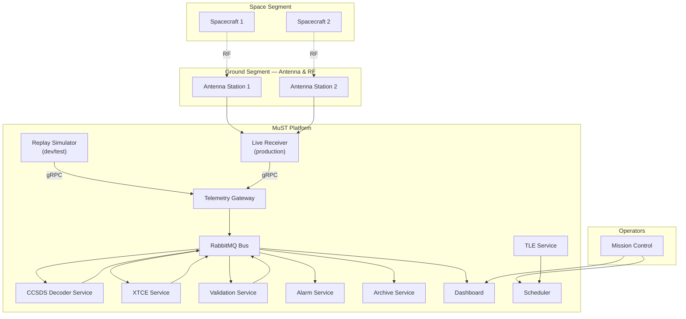
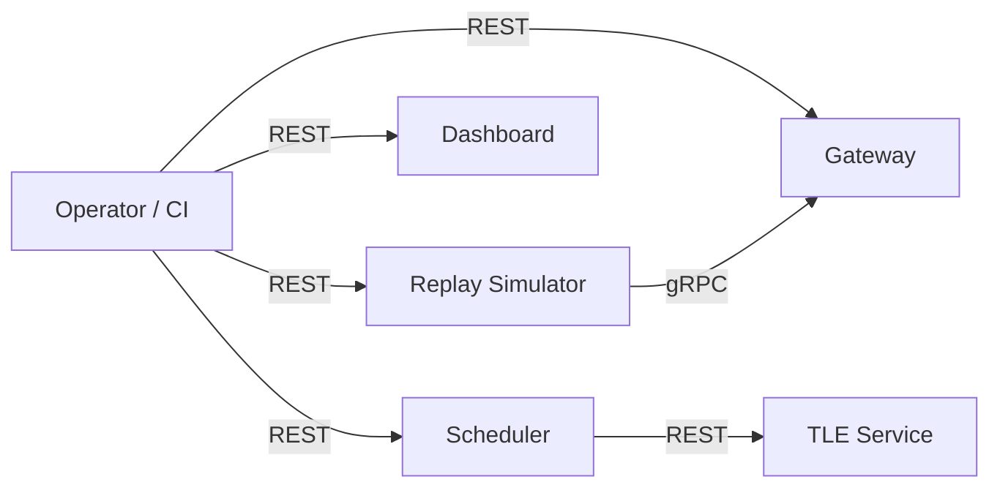

# MuST — System Architecture

| Field              | Value                                    |
|--------------------|------------------------------------------|
| **Document ID**    | MUST-SYS-004                             |
| **Version**        | 1.0.0-DRAFT                             |
| **Date**           | 2026-07-03                               |
| **Status**         | DRAFT — PENDING REVIEW                   |

---

## 1. System Overview

MuST (Multi-Station Telemetry & Tracking System) is a ground segment software platform for real-time telemetry acquisition, processing, monitoring, and archival from multiple spacecraft simultaneously.

### 1.1 System Context Diagram



---

## 2. Service Catalog

| Service | Language | Purpose | Status |
|---------|----------|---------|--------|
| **Replay Simulator** | Rust | Replay recorded telemetry files | Implemented (Version 1) |
| **Live Receiver** | Rust | Receive live telemetry from antenna | Planned (v2) |
| **Telemetry Gateway** | Rust | Ingress validation, mission routing, envelope stamping | Implemented (Version 1) |
| **CCSDS Decoder Service** | Rust | Parse CCSDS packet headers, extract TM parameters | Implemented (Version 1) |
| **XTCE Service** | Rust/Python | Apply XTCE database, calibrate engineering values | Needs spec |
| **Validation Service** | Rust | Check limits, flag anomalies, quality assessment | Needs spec |
| **Alarm Service** | Rust | Limit breach notifications, alarm history | Needs spec |
| **Archive Service** | Rust | Persist raw + engineering telemetry to storage | Needs spec |
| **Dashboard Service** | TypeScript | Real-time telemetry display, operator console | Needs spec |
| **Scheduler Service** | Python/Rust | Pass scheduling, antenna allocation | Existing (SuTra) |
| **TLE Service** | Python | TLE ingestion, propagation, visibility | Existing (SuTra) |
| **RabbitMQ** | Erlang | Message bus | Infrastructure |
| **Prometheus** | Go | Metrics collection | Infrastructure |
| **Grafana** | Go | Metrics visualization | Infrastructure |

---

## 3. Service Interaction Map

### 3.1 Telemetry Pipeline (Data Plane)

┌─────────────────┐
│ Replay Simulator│
│ (or Receiver)   │
└────────┬────────┘
         │
    streams gRPC
         │
         ▼
┌─────────────────┐
│Telemetry Gateway│─── publishes ──┐
│ (validate, stamp)│                │
└─────────────────┘                ▼
                          telemetry.raw exchange
                                   │
                    ┌──────────────┴──────────────┐
                    │                             │
                    ▼                             ▼
             ┌────────────┐                ┌────────────┐
             │ CCSDS Dec  │                │ Archive    │
             │ (parse hdr)│                │ (store raw)│
             └─────┬──────┘                └────────────┘
                   │
         telemetry.decoded exchange
                   │
                   ▼
         ┌──────────────────┐
         │   XTCE Service   │
         │  (calibrate,     │
         │   decommutate)   │
         └─────────┬────────┘
                   │
        telemetry.engineering exchange
                   │
      ┌────────────┴────────────┐
      │            │            │
      ▼            ▼            ▼
┌─────────────┐ ┌──────────┐ ┌──────────┐
│ Validation  │ │Dashboard │ │ Archive  │
│ (limits)    │ │(display) │ │(store eng│
└──────┬──────┘ └──────────┘ └──────────┘
       │
telemetry.alarm exchange
       │
       ▼
┌────────────┐
│ Alarm Svc  │
│ (notify)   │
└────────────┘

### 3.2 Control Plane



---

## 4. Service Responsibilities

### 4.1 Replay Simulator Service (Specified & Implemented)

**Input:** Telemetry files (binary, CCSDS)
**Output:** gRPC stream of `TelemetryEnvelope` messages to Telemetry Gateway
**Responsibility:** Read files, preserve timing, publish packets as if live

(Full specification in `simulator-engine/docs/`)

### 4.2 Telemetry Gateway (Specified & Implemented)

**Input:** gRPC stream of `TelemetryEnvelope` messages from Replay Simulator / Live Receiver
**Output:** Validated, enriched `TelemetryEnvelope` published to `telemetry.raw` exchange
**Responsibility:**

| Function | Description | Why |
|----------|-------------|-----|
| Ingress validation | Verify envelope completeness, reject malformed | First line of defense |
| Mission routing | Resolve mission/satellite from source config | Source may not know mission context |
| Rate monitoring | Track packet rates per source | Detect source anomalies |
| Envelope stamping | Set receive_timestamp, station info | Centralized timestamp authority |

### 4.3 CCSDS Decoder Service (Specified & Implemented)

**Input:** `TelemetryEnvelope` from `telemetry.raw` exchange
**Output:** `TelemetryEnvelope` with parsed `ccsds_header` on `telemetry.decoded` exchange
**Responsibility:**

| Function | Description | Why |
|----------|-------------|-----|
| Header parsing | Parse 6-byte CCSDS primary header | Downstream needs APID, sequence count |
| Secondary header | Parse time-code field (CUC) | Extract onboard timestamp |
| Sequence validation | Detect gaps/duplicates in per-APID sequence | Packet loss and anomaly detection |
| Quality update | Set crc_ok, sequence_continuous flags | Progressive quality assessment |

### 4.4 XTCE Service (Needs Spec)

**Input:** `TelemetryEnvelope` from `telemetry.ccsds`
**Output:** `EngineeringTelemetry` on `telemetry.engineering`
**Responsibility:**

| Function | Description | Why |
|----------|-------------|-----|
| XTCE database loading | Parse XTCE XML database for mission | XTCE is the standard for TM/TC database (ECSS-E-ST-70-31C) |
| Decommutation | Extract parameter values from packet data field | Map bit positions to named parameters |
| Calibration | Apply calibration curves (polynomial, interpolation) | Convert raw counts to engineering units |
| Derived parameters | Compute synthetic parameters from raw values | Some parameters are calculated, not transmitted |

### 4.5 Validation Service (Needs Spec)

**Input:** `EngineeringTelemetry` from `telemetry.engineering`
**Output:** Limit breach events on `telemetry.alarm`
**Responsibility:**

| Function | Description | Why |
|----------|-------------|-----|
| Limit checking | Compare values against configured limits | Detect anomalies |
| Multi-level limits | Warning (soft) and critical (hard) thresholds | Graduated response |
| Persistence check | Alarm only if breach persists for N samples | Prevent transient spikes from alarming |
| Stale detection | Flag parameters that haven't updated | Detect telemetry loss |

### 4.6 Archive Service (Needs Spec)

**Input:** Envelopes from `telemetry.raw` and `telemetry.engineering`
**Output:** Persisted data (HDF5, TimescaleDB, or similar)
**Responsibility:**

| Function | Description | Why |
|----------|-------------|-----|
| Raw archival | Store every raw packet with full envelope | Regulatory and mission requirement |
| Engineering archival | Store decoded parameter time-series | Historical analysis, trending |
| Indexed retrieval | Query by mission, satellite, APID, time range | Post-pass analysis |
| Data retention | Enforce retention policies | Storage management |

### 4.7 Dashboard Service (Needs Spec)

**Input:** `EngineeringTelemetry` from `telemetry.engineering`
**Output:** Real-time web UI
**Responsibility:**

| Function | Description | Why |
|----------|-------------|-----|
| Real-time display | Show parameter values as they arrive | Operator situational awareness |
| Strip charts | Time-series visualization | Trend detection |
| Alarm display | Show active alarms with severity | Operator attention management |
| Pass timeline | Show upcoming contacts, current pass status | Operational planning |

---

## 5. Cross-Cutting Concerns

### 5.1 Observability Stack

```
┌─────────────────────────────────────────────┐
│                 Grafana                      │
│  (dashboards, alerts)                       │
└─────────────┬─────────────┬─────────────────┘
              │             │
     ┌────────▼────┐  ┌─────▼─────┐
     │ Prometheus  │  │   Loki    │
     │ (metrics)   │  │  (logs)   │
     └──────┬──────┘  └─────┬─────┘
            │               │
    ┌───────┼───────────────┼───────┐
    │       │               │       │
    ▼       ▼               ▼       ▼
  RSS    CCSDS           XTCE   Archive
  /metrics              /metrics
  JSON logs             JSON logs
```

Every service MUST:
- Expose Prometheus metrics at `/metrics`
- Emit structured JSON logs via `tracing`
- Expose health probes at `/health/{live,ready,startup}`
- Include `service_name` and `service_version` labels on all metrics

### 5.2 Configuration

Every service MUST:
- Accept YAML configuration files
- Support environment variable overrides (double-underscore convention)
- Log effective configuration at startup (masking secrets)

### 5.3 Deployment

Every service MUST:
- Run in a Docker container
- Use multi-stage builds (builder + slim runtime)
- Run as non-root user
- Define health checks in Dockerfile

---

## 6. Development Roadmap

### Phase 1: Foundation (Complete)

| Deliverable | Status |
|-------------|--------|
| Architectural Decision Log | ✅ Complete |
| Shared Contracts (protobuf) | ✅ Complete |
| Message Bus Design | ✅ Complete |
| System Architecture | ✅ Complete |
| Replay Simulator Spec | ✅ Complete |
| Telemetry Gateway Spec | ✅ Complete |
| CCSDS Decoder Spec | ✅ Complete |

### Phase 2: Remaining Service Specs (Next)

| Deliverable | Status |
|-------------|--------|
| XTCE Service Spec | ❌ Needs spec |
| Validation Service Spec | ❌ Needs spec |
| Alarm Service Spec | ❌ Needs spec |
| Archive Service Spec | ❌ Needs spec |
| Dashboard Service Spec | ❌ Needs spec |

### Phase 3: Implementation

| Deliverable | Dependencies | Status |
|-------------|-------------|--------|
| Shared proto package | Phase 1 contracts | ✅ Complete |
| Replay Simulator impl | Shared proto | ✅ Complete (v1) |
| Telemetry Gateway impl | Shared proto, gRPC | ✅ Complete (v1) |
| CCSDS Decoder impl | Shared proto, bus design | ✅ Complete (v1) |
| XTCE Service impl | Shared proto, CCSDS | ❌ Planned |
| Remaining services | Respective specs | ❌ Planned |

### Phase 4: Integration

| Deliverable | Dependencies | Status |
|-------------|-------------|--------|
| End-to-end pipeline test | Core services (Sim -> GW -> Decoder) | ✅ Complete (v1) |
| Live receiver integration | Replay → Receiver swap | ❌ Planned |
| Dashboard integration | All engineering data flowing | ❌ Planned |

---

## 7. Revision History

| Version | Date       | Description |
|---------|------------|-------------|
| 1.0.0   | 2026-07-03 | Initial draft — system architecture |
