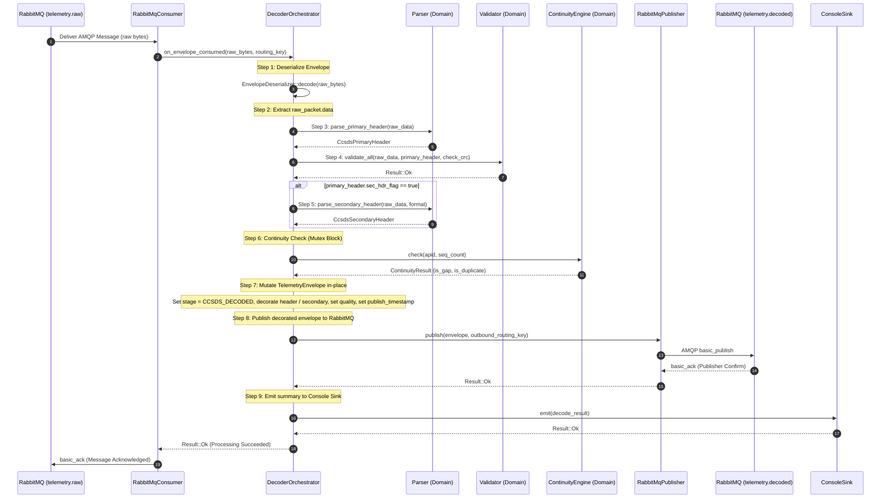
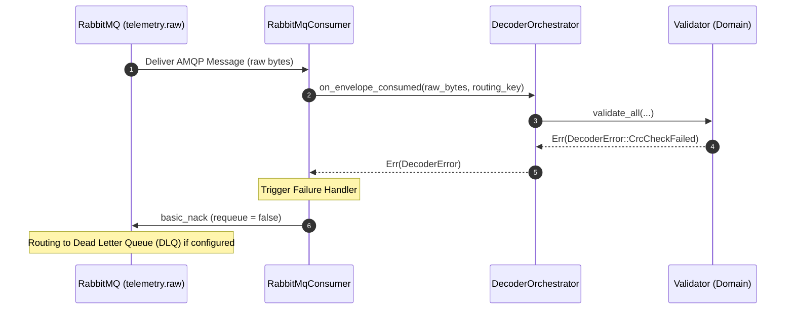

# CCSDS Decoder Service — Sequence Diagram

| Field              | Value                                    |
|--------------------|------------------------------------------|
| **Document ID**    | MUST-DEC-SEQ-003                         |
| **Version**        | 1.0.0                                    |
| **Date**           | 2026-07-09                               |
| **Status**         | APPROVED                                 |

---

## 1. End-to-End Telemetry Processing Flow

The diagram below details the sequence of processing from the moment a message is consumed from `telemetry.raw` to its publish on `telemetry.decoded`.

---

## 2. Error and NACK Sequence

When parsing, validation, or network publishing fails, the message must be rejected (NACK'd) to prevent queue deadlocks and ensure no telemetry is lost.

