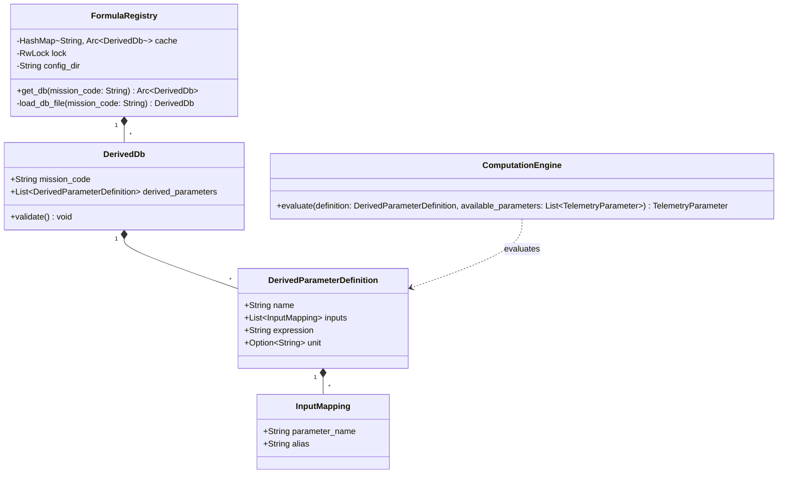

# Engineering Conversion Service — Architecture Document

| Field              | Value                                    |
|--------------------|------------------------------------------|
| **Document ID**    | MUST-ECS-ARCH-002                        |
| **Version**        | 1.0.0                                    |
| **Date**           | 2026-07-10                               |
| **Status**         | PROPOSED                                 |

---

## 1. High-Level Architecture

The Engineering Conversion Service is built using the **Hexagonal Architecture (Ports and Adapters)** pattern. This architectural style isolates the core domain logic (derived telemetry parameter calculations and expression evaluation) from external infrastructure dependencies like RabbitMQ messaging, the local file system, and Protobuf serialization.

### 1.1 Context Diagram
```
           Ingress Bus                       Egress Bus
        ┌──────────────┐                  ┌──────────────┐
        │  RabbitMQ    │                  │  RabbitMQ    │
        │  telemetry   │                  │  telemetry   │
        │ .engineering │                  │ .engineering │
        │(decommutated)│                  │(engineering) │
        └──────┬───────┘                  └──────▲───────┘
               │                                 │
               │ [consume]                       │ [publish]
        ┌──────▼─────────────────────────────────┴──────┐
        │                                               │
        │      ENGINEERING CONVERSION SERVICE           │
        │                                               │
        └───────────────────────────────────────────────┘
```

---

## 2. Hexagonal Architecture Pattern

The service is divided into three layers: Driving Adapters (Inbound), Application Core, and Driven Adapters (Outbound).

```
┌─────────────────────────────────────────────────────────────────────┐
│                    DRIVING ADAPTERS (Inbound)                       │
│  ┌──────────────────────────────────────────────────────────────┐  │
│  │ RabbitMqConsumer (lapin)                                     │  │
│  │ (Consumes envelopes from queue bound to '#.decommutated')    │  │
│  └───────────────────────┬──────────────────────────────────────┘  │
│                          │                                          │
│                          ▼                                          │
│                  ┌───────────────┐                                  │
│                  │    PORTS      │ (EnvelopeConsumer, DeliveryAcker)│
│                  └───────┬───────┘                                  │
├──────────────────────────┼──────────────────────────────────────────┤
│                     APPLICATION CORE                                 │
│  ┌───────────────────────▼────────────────────────────────────────┐  │
│  │               ConversionOrchestrator                           │  │
│  │                                                                │  │
│  │  ┌─────────────────────────┐     ┌─────────────────────────┐   │  │
│  │  │ ComputationEngine (Core)│     │ FormulaRegistry (Core)  │   │  │
│  │  └─────────────────────────┘     └─────────────────────────┘   │  │
│  └───────────────────────┬────────────────────────────────────────┘  │
│                          │                                          │
│                  ┌───────▼───────┐                                  │
│                  │    PORTS      │ (EngineeringPublisher, AlertPort) │
│                  └───────┬───────┘                                  │
├──────────────────────────┼──────────────────────────────────────────┤
│                    DRIVEN ADAPTERS (Outbound)                        │
│  ┌───────────────────────────────┬──────────────────────────────┐  │
│  │ RabbitMqPublisher (lapin)     │ LoggingAlertPublisher        │  │
│  │ (Publishes to 'engineering'   │ (Emits warnings and errors)  │  │
│  │  exchange with '.engineering' │                              │  │
│  │  routing key suffix)          │                              │  │
│  └───────────────────────────────┴──────────────────────────────┘  │
└─────────────────────────────────────────────────────────────────────┘
```

### 2.1 Module Responsibilities

#### 2.1.1 Driving Adapters (Inbound)
* **`RabbitMqConsumer`**: Integrates with `lapin` to establish a subscription on `telemetry.engineering` bound to the `#.decommutated` routing pattern. It deserializes Protobuf envelopes and delegates processing to the application orchestrator.

#### 2.1.2 Ports Boundary
* **`EnvelopeConsumer`**: Port trait defining the start of the asynchronous consuming pipeline.
* **`DeliveryAcker`**: Port wrapper wrapping AMQP message acknowledgment controls (`ack`, `nack`).
* **`EngineeringPublisher`**: Outbound port trait for publishing the enriched envelope.
* **`AlertPort`**: Outbound port trait for logging warnings, critical anomalies, or configuration parsing errors.

#### 2.1.3 Application Core
* **`ConversionOrchestrator`**: The composition coordinator. It implements the use-case pipeline: receives raw bytes, deserializes them, queries the configuration registry, extracts inputs from the envelope, executes the derived calculations, appends the results, updates the metadata stage to `PROCESSING_STAGE_ENGINEERING_CONVERTED`, and publishes the final envelope downstream.

#### 2.1.4 Domain Core (Framework-Free)
* **`FormulaRegistry`**: Manages dynamic, thread-safe, in-memory caching of parsed formula schemas (`DerivedDb`) from the file system.
* **`ComputationEngine`**: Extracts values from telemetry parameter structures, maps them to expressions, parses the formulas into Abstract Syntax Trees (AST), evaluates them, and compiles the computed outputs into standard `TelemetryParameter` objects.

#### 2.1.5 Driven Adapters (Outbound)
* **`RabbitMqPublisher`**: Implements `EngineeringPublisher` using `lapin` with publisher confirmations and automated retries.
* **`LoggingAlertPublisher`**: Implements `AlertPort` using the `tracing` framework to publish structured logs and runtime anomalies.

---

## 3. Directory Folder Structure

The directory structure mirrors the other MuST microservices:

```
engineering-conversion-service/
├── Cargo.toml                  # Project manifest (lapin, prost, tokio, evalexpr, serde)
├── build.rs                    # Tonic/prost proto compilation script
├── src/
│   ├── main.rs                 # Composition root
│   ├── config.rs               # Application configuration loader (AppConfig from env)
│   ├── domain/                 # Pure domain business logic (no external frameworks)
│   │   ├── mod.rs
│   │   ├── registry.rs         # FormulaRegistry (in-memory cache for YAML files)
│   │   ├── computation.rs      # Derived parameter evaluation engine
│   │   ├── models.rs           # Formula, DerivedDb, InputMapping domain representations
│   │   └── errors.rs           # Custom domain errors
│   ├── application/            # Coordinates the use cases
│   │   ├── mod.rs
│   │   └── orchestrator.rs     # ConversionOrchestrator coordination
│   ├── ports/                  # Interface boundaries (inbound/outbound)
│   │   ├── mod.rs
│   │   ├── inbound.rs          # EnvelopeConsumer, DeliveryAcker ports
│   │   └── outbound.rs         # EngineeringPublisher, AlertPort ports
│   ├── adapters/               # Port implementations (lapin, logging)
│   │   ├── mod.rs
│   │   ├── inbound/
│   │   │   ├── mod.rs
│   │   │   └── rabbitmq_consumer.rs # Lapin consumer implementation
│   │   └── outbound/
│   │       ├── mod.rs
│   │       ├── rabbitmq_publisher.rs # Lapin publisher implementation
│   │       └── logging_alert.rs      # System warning / alert logger
│   └── proto.rs                # Rust representation of compiled shared protobufs
└── docs/                       # Architecture and Specification documents
```

---

## 4. Core Domain Model

The core domain model focuses on defining derived parameter configurations and parsing/evaluating math expressions.



---

## 5. Ports & Adapters Interfaces

Interfaces are defined using asynchronous Rust traits:

```rust
// File: src/ports/inbound.rs
use std::sync::Arc;
use async_trait::async_trait;
use futures::future::BoxFuture;
use crate::domain::errors::DomainError;

/// A handle to ACK or NACK messages in RabbitMQ.
pub struct DeliveryAcker {
    inner: Box<dyn AckerInner + Send>,
}

#[async_trait]
pub(crate) trait AckerInner {
    async fn ack(&mut self);
    async fn nack(&mut self);
}

impl DeliveryAcker {
    pub(crate) fn new(inner: Box<dyn AckerInner + Send>) -> Self {
        Self { inner }
    }
    pub async fn ack(mut self) {
        self.inner.ack().await;
    }
    pub async fn nack(mut self) {
        self.inner.nack().await;
    }
}

pub type HandlerFn =
    Arc<dyn Fn(Vec<u8>, String, DeliveryAcker) -> BoxFuture<'static, ()> + Send + Sync>;

#[async_trait]
pub trait EnvelopeConsumer: Send + Sync {
    /// Starts consuming messages, delegating processing to the handler callback.
    async fn start(&self, handler: HandlerFn) -> Result<(), DomainError>;
}
```

```rust
// File: src/ports/outbound.rs
use async_trait::async_trait;
use crate::domain::errors::DomainError;
use crate::proto::TelemetryEnvelope;

#[async_trait]
pub trait EngineeringPublisher: Send + Sync {
    /// Publishes the enriched telemetry envelope downstream.
    async fn publish(&self, envelope: &TelemetryEnvelope, routing_key: &str) -> Result<(), DomainError>;
}

#[async_trait]
pub trait AlertPort: Send + Sync {
    /// Emits warnings or alerts for pipeline anomalies.
    async fn emit_warning(&self, context: &str, message: &str);
    async fn emit_critical(&self, context: &str, message: &str);
}
```
