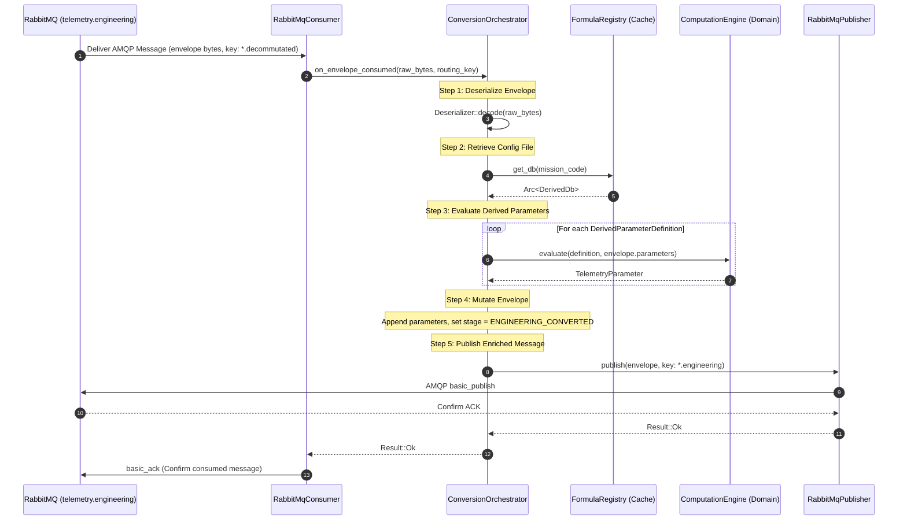
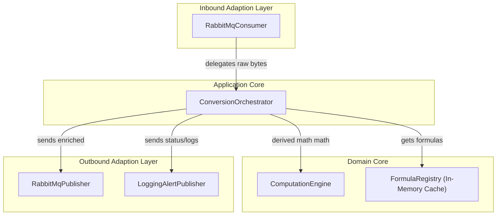
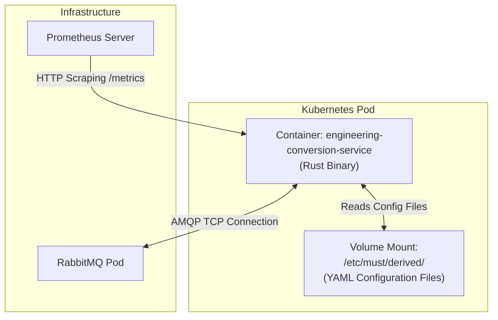
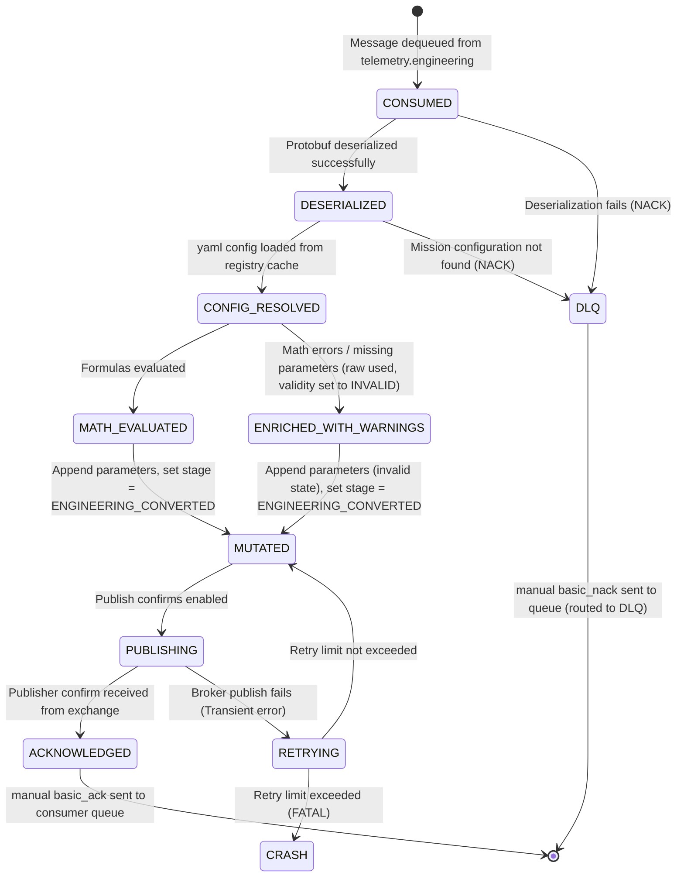

# Engineering Conversion Service — Contracts and Data Flow

| Field              | Value                                    |
|--------------------|------------------------------------------|
| **Document ID**    | MUST-ECS-CON-003                        |
| **Version**        | 1.0.0                                    |
| **Date**           | 2026-07-10                               |
| **Status**         | PROPOSED                                 |

---

## 1. Protobuf Contract Updates

To support the injection of the Engineering Conversion Service into the telemetry pipeline, we define a new value in the shared `ProcessingStage` enum in `shared/proto/must/telemetry/v1/envelope.proto`.

### 1.1 Protobuf Enum Diff
```diff
// File: shared/proto/must/telemetry/v1/envelope.proto

 enum ProcessingStage {
   PROCESSING_STAGE_UNSPECIFIED = 0;
   PROCESSING_STAGE_RAW = 1;              // Raw bytes from source (Replay/Receiver)
   PROCESSING_STAGE_CCSDS_DECODED = 2;    // CCSDS headers parsed (CCSDS Service)
   PROCESSING_STAGE_ENGINEERING = 3;      // Engineering values extracted (XTCE Service)
   PROCESSING_STAGE_VALIDATED = 4;        // Limits checked (Validation Service)
   PROCESSING_STAGE_ARCHIVED = 5;         // Written to storage (Archive Service)
   PROCESSING_STAGE_IDENTIFIED = 6;        // Mission/satellite identified (Mission ID Service)
+  PROCESSING_STAGE_ENGINEERING_CONVERTED = 7; // Derived parameters computed (Conversion Service)
 }
```

---

## 2. RabbitMQ Topology & Contracts

The service acts as a middleware processor on the `telemetry.engineering` exchange. It ingests decommutated packets, processes them, and publishes them back to the same exchange with an updated routing key.

```
                  Exchange: telemetry.engineering (Topic)
                                │
                      [routing: *.decommutated]
                                ▼
                      Queue: engineering.convert
                                │
                    [Engineering Conversion]
                                │
                       [routing: *.engineering]
                                ▼
                  Exchange: telemetry.engineering (Topic)
```

### 2.1 Input Bindings
* **Exchange**: `telemetry.engineering` (topic, durable)
* **Queue**: `engineering.convert` (durable, configured with DLX `must.dlx`)
* **Routing Key Pattern**: `#.decommutated` (captures all decommutated envelopes from the XTCE Decoder)
* **QoS Prefetch**: `50` (optimized for parallel thread computation)

### 2.2 Output Bindings
* **Exchange**: `telemetry.engineering` (topic, durable)
* **Outbound Routing Key**: `{mission_code}.sat{satellite_id}.{apid}.engineering`
  * *Example*: `cy3.sat101.42.engineering`
  * *Note*: By publishing with the `.engineering` suffix, the Validation Service (bound to `#.engineering` on the same exchange) automatically ingests the message.

### 2.3 AMQP Message Properties
Every published envelope MUST declare these properties:
* `content_type`: `application/x-protobuf`
* `delivery_mode`: `2` (persistent)
* `message_id`: Matching `envelope.envelope_id` (preserves trace correlation)
* `app_id`: `engineering-conversion-service`

---

## 3. One Packet Journey Through Every Layer

Here is the step-by-step lifecycle of a single packet, focusing on how parameters are evaluated and enriched:

### 3.1 Step 1: Consumption and Deserialization
The service consumes an envelope from the `engineering.convert` queue.
* **Routing Key**: `cy3.sat101.42.decommutated`
* **Stage**: `PROCESSING_STAGE_ENGINEERING`
* **Parameters in Envelope**:
  1. Name: `/SC/EPS/BatteryVoltage`, Raw: `2755`, Engineering: `27.55` (Float), Validity: `Valid`
  2. Name: `/SC/EPS/BatteryCurrent`, Raw: `400`, Engineering: `4.0` (Float), Validity: `Valid`

### 3.2 Step 2: Configuration Lookup
The orchestrator reads the mission code `cy3` and performs a cache lookup in `FormulaRegistry`.
It retrieves `cy3.yaml` which defines the derived parameter rules:
```yaml
derived_parameters:
  - name: "/SC/EPS/BatteryPower"
    inputs:
      - parameter_name: "/SC/EPS/BatteryVoltage"
        alias: "v"
      - parameter_name: "/SC/EPS/BatteryCurrent"
        alias: "i"
    expression: "v * i"
```

### 3.3 Step 3: Expression Evaluation
The `ComputationEngine` resolves the inputs:
* Maps `/SC/EPS/BatteryVoltage` to alias `v` with value `27.55`
* Maps `/SC/EPS/BatteryCurrent` to alias `i` with value `4.0`
* Evaluates expression: `27.55 * 4.0` -> `110.2` (Float)
* Creates a new `TelemetryParameter`:
  * Name: `/SC/EPS/BatteryPower`
  * Raw Value: `None` (derived parameters have no raw telemetry source)
  * Engineering Value: `110.2` (Float)
  * Validity: `PARAMETER_VALIDITY_VALID`

### 3.4 Step 4: Envelope Enrichment and Publication
The orchestrator appends the new parameter to the envelope's parameters list (leaving the original parameters unchanged).
* **New Parameters List**:
  1. `/SC/EPS/BatteryVoltage` (27.55)
  2. `/SC/EPS/BatteryCurrent` (4.0)
  3. `/SC/EPS/BatteryPower` (110.2)
* **Stage Updated**: `PROCESSING_STAGE_ENGINEERING_CONVERTED`
* **Outbound Routing Key**: `cy3.sat101.42.engineering`
* **Egress**: Published to `telemetry.engineering` with manual ACK confirmation.

---

## 4. Sequence Diagram



---

## 5. Component Diagram



---

## 6. Deployment Diagram



---

## 7. Message State Diagram


