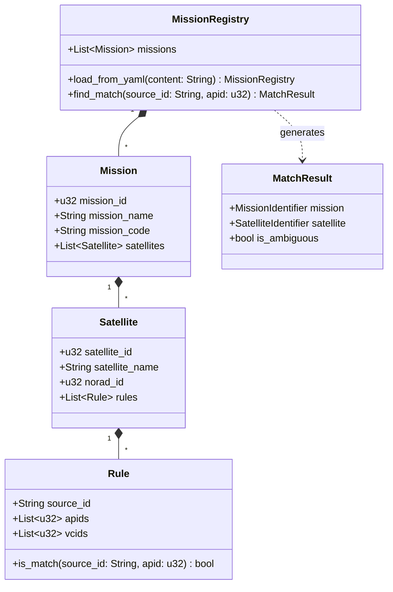
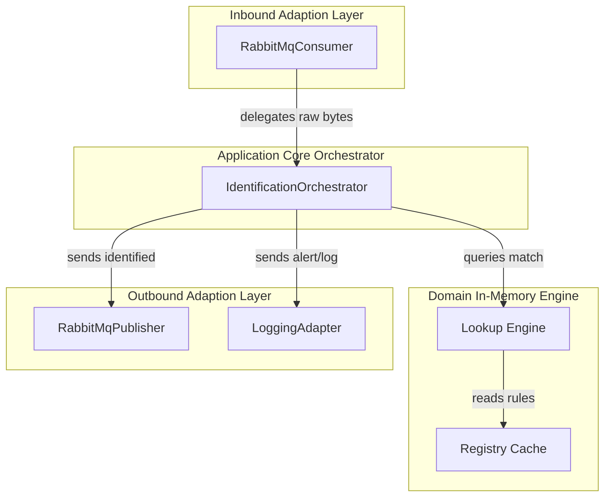

# Mission Identification Service — Architecture Document

| Field              | Value                                    |
|--------------------|------------------------------------------|
| **Document ID**    | MUST-MIS-ARCH-002                        |
| **Version**        | 1.0.0                                    |
| **Date**           | 2026-07-09                               |
| **Status**         | PROPOSED                                 |

---

## 1. Hexagonal Architecture Pattern

The Mission Identification Service is designed strictly following **Hexagonal Architecture (Ports and Adapters)**. This keeps the core business logic (rule-based matching engine) completely isolated from RabbitMQ messaging libraries, configuration formats, and database layers.

```
┌─────────────────────────────────────────────────────────────────────┐
│                    DRIVING ADAPTERS (Inbound)                       │
│  ┌──────────────────────────────────────────────────────────────┐  │
│  │ RabbitMqConsumer (lapin)                                     │  │
│  │ (Consumes envelopes from queue bound to '#.decoded')          │  │
│  └───────────────────────┬──────────────────────────────────────┘  │
│                          │                                          │
│                          ▼                                          │
│                  ┌───────────────┐                                  │
│                  │    PORTS      │ (EnvelopeConsumer, DeliveryAcker)│
│                  └───────┬───────┘                                  │
├──────────────────────────┼──────────────────────────────────────────┤
│                     APPLICATION CORE                                 │
│  ┌───────────────────────▼────────────────────────────────────────┐  │
│  │               IdentificationOrchestrator                       │  │
│  │                                                                │  │
│  │  ┌─────────────────────────┐     ┌─────────────────────────┐   │  │
│  │  │ RuleLookupEngine (Core) │     │ MissionRegistry (Core)  │   │  │
│  │  └─────────────────────────┘     └─────────────────────────┘   │  │
│  └───────────────────────┬────────────────────────────────────────┘  │
│                          │                                          │
│                  ┌───────▼───────┐                                  │
│                  │    PORTS      │ (IdentifiedPublisher, AlertPort) │
│                  └───────┬───────┘                                  │
├──────────────────────────┼──────────────────────────────────────────┤
│                    DRIVEN ADAPTERS (Outbound)                        │
│  ┌───────────────────────────────┬──────────────────────────────┐  │
│  │ RabbitMqPublisher (lapin)     │ LoggingAlertPublisher        │  │
│  │ (Publishes to 'identified'    │ (Emits warnings and errors)  │  │
│  │  exchange)                    │                              │  │
│  └───────────────────────────────┴──────────────────────────────┘  │
└─────────────────────────────────────────────────────────────────────┘
```

---

## 2. Directory Folder Structure

The service layout matches the existing Rust services (`telemetry-gateway`, `ccsds-decoder`), enforcing a clean structure:

```
mission-identification-service/
├── Cargo.toml                  # Cargo manifest containing lapin, prost, tokio dependencies
├── build.rs                    # Optional build script for proto compilation
├── src/
│   ├── main.rs                 # Composition root (loads config, builds components, starts loop)
│   ├── config.rs               # Application configurations (AppConfig from env)
│   ├── domain/                 # Core domain logic (framework-free)
│   │   ├── mod.rs
│   │   ├── registry.rs         # Rule registry definitions
│   │   ├── lookup.rs           # Core lookup matching logic
│   │   ├── models.rs           # Mission and Satellite domain representations
│   │   └── errors.rs           # Custom domain errors
│   ├── application/            # Coordinates the use cases
│   │   ├── mod.rs
│   │   └── orchestrator.rs     # IdentificationOrchestrator coordination
│   ├── ports/                  # Interface boundary definitions (inbound/outbound)
│   │   ├── mod.rs
│   │   ├── inbound.rs          # EnvelopeConsumer, DeliveryAcker ports
│   │   └── outbound.rs         # IdentifiedPublisher, AlertPort ports
│   ├── adapters/               # Framework-specific implementations of ports
│   │   ├── mod.rs
│   │   ├── inbound/
│   │   │   ├── mod.rs
│   │   │   └── rabbitmq_consumer.rs # Lapin consumer implementation
│   │   └── outbound/
│   │       ├── mod.rs
│   │       ├── rabbitmq_publisher.rs # Lapin publisher implementation
│   │       └── logging_alert.rs      # System warning / alert logger
│   └── proto.rs                # Rust representation of compiled shared protobufs
└── docs/                       # Architecture and Specification documents
```

---

## 3. Core Domain Model

The core domain model encapsulates the rule-matching engine:



---

## 4. Component Diagram



---

## 5. Deployment Diagram

The service compiles down to a single lightweight binary, deployed as a containerized application:

```
┌──────────────────────────────────────────────────────────────┐
│                    Kubernetes Pod Namespace                  │
│                                                              │
│  ┌────────────────────────┐      ┌────────────────────────┐  │
│  │ Container: RabbitMQ    │      │ Container: MIS         │  │
│  │ (Durable Exchange)     │<────>│ (Rust Executable Binary)│  │
│  └────────────────────────┘      └───────────┬────────────┘  │
│                                              │               │
│                                              ▼               │
│                                  ┌────────────────────────┐  │
│                                  │ Prometheus Scraping    │  │
│                                  │ (Port 8083 /metrics)   │  │
│                                  └────────────────────────┘  │
└──────────────────────────────────────────────────────────────┘
```
- **Liveness Probe**: Commands checking executing PID (`pgrep mission-identification-service`).
- **Readiness Probe**: Connection to RabbitMQ bus checked periodically.
- **Resource Constraints**: CPU limit 1.0 core, Memory limit 128 MiB.
