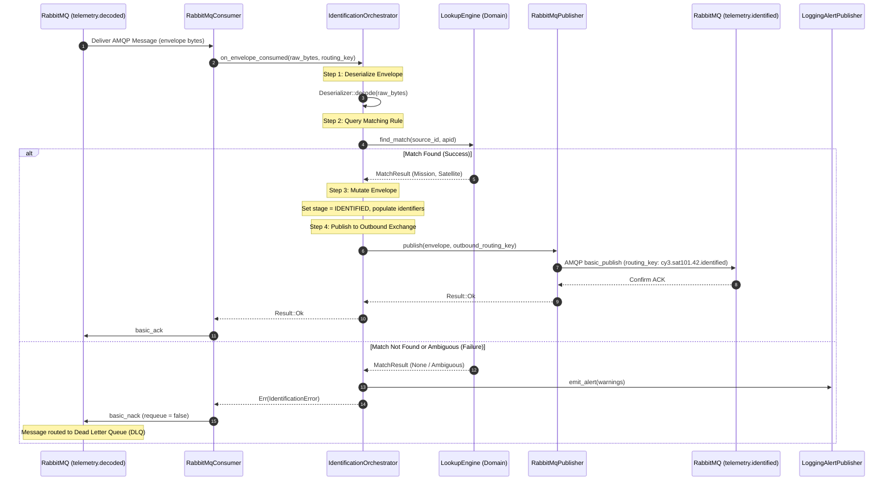
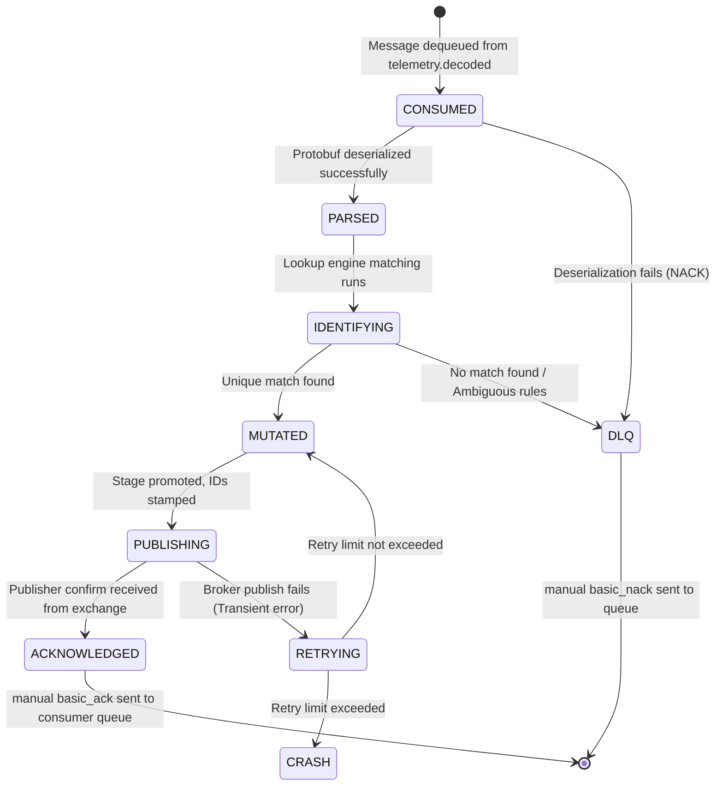

# Mission Identification Service — Contracts and Data Flow

| Field              | Value                                    |
|--------------------|------------------------------------------|
| **Document ID**    | MUST-MIS-CON-003                         |
| **Version**        | 1.0.0                                    |
| **Date**           | 2026-07-09                               |
| **Status**         | PROPOSED                                 |

---

## 1. Protobuf Contracts

The service uses the shared Protobuf schema definitions located in `shared/proto/`. In order to support the new processing stage, the `ProcessingStage` enum inside `shared/proto/must/telemetry/v1/envelope.proto` will be updated:

```protobuf
// File: shared/proto/must/telemetry/v1/envelope.proto
// Backward-compatible update to the enum mapping:

enum ProcessingStage {
  PROCESSING_STAGE_UNSPECIFIED = 0;
  PROCESSING_STAGE_RAW = 1;
  PROCESSING_STAGE_CCSDS_DECODED = 2;
  PROCESSING_STAGE_IDENTIFIED = 6;      // NEW: Added to trace Mission Identification step
  PROCESSING_STAGE_ENGINEERING = 3;
  PROCESSING_STAGE_VALIDATED = 4;
  PROCESSING_STAGE_ARCHIVED = 5;
}
```

---

## 2. RabbitMQ Contracts

The Mission Identification Service adheres strictly to the system-wide message bus topology.

### 2.1 Input Bindings
- **Exchange**: `telemetry.decoded` (topic, durable)
- **Queue**: `mission.identify` (durable, configured with `must.dlx` dead letter exchange)
- **Routing Key Pattern**: `#.decoded`
- **QoS Prefetch**: `50` (optimized for concurrent CPU lookup capacity)

### 2.2 Output Bindings
- **Exchange**: `telemetry.identified` (topic, durable)
- **Outbound Routing Key**: `{mission_code}.{satellite_id}.{apid}.identified`
  - *Example*: `cy3.sat101.42.identified`

### 2.3 AMQP Properties
Every published message must include:
- `content_type`: `application/x-protobuf`
- `delivery_mode`: `2` (persistent)
- `message_id`: Corresponding `envelope.envelope_id`
- `app_id`: `mission-identification-service`

---

## 3. End-to-End Packet Journey

Below is the lifecycle walkthrough of a single telemetry frame traversing the system:

```
[Replay Simulator] 
  │ 
  │ 1. Raw binary file read: APID=42, Seq=1200
  │    Sends gRPC StreamTelemetryRequest
  ▼
[Telemetry Gateway]
  │ 
  │ 2. Validates frame, stamps original_timestamp.
  │    Publishes to 'telemetry.raw' exchange.
  │    Routing Key: "unk.sat0.0042.raw"
  ▼
[CCSDS Decoder Service]
  │ 
  │ 3. Consumes "#.raw". Parses CCSDS primary header.
  │    Tracks continuity, sets stage to CCSDS_DECODED.
  │    Publishes to 'telemetry.decoded' exchange.
  │    Routing Key: "unk.sat0.0042.decoded"
  ▼
[Mission Identification Service]
  │ 
  │ 4. Consumes "#.decoded". Inspects source_id ("rss-replay") and APID (42).
  │    Looks up rule: source_id="rss-replay" + APID=42 maps to:
  │      - mission_code: "cy3", mission_id: 1
  │      - satellite_id: 101, satellite_name: "Propulsion Module"
  │    Updates envelope: mission, satellite, and promotes stage to IDENTIFIED.
  │    Publishes to 'telemetry.identified' exchange.
  │    Routing Key: "cy3.sat101.42.identified"
  ▼
[XTCE Service] (Next step)
```

---

## 4. Sequence Diagram



---

## 5. Message State Machine

The state transition lifecyle of a telemetry envelope during processing in the service:


