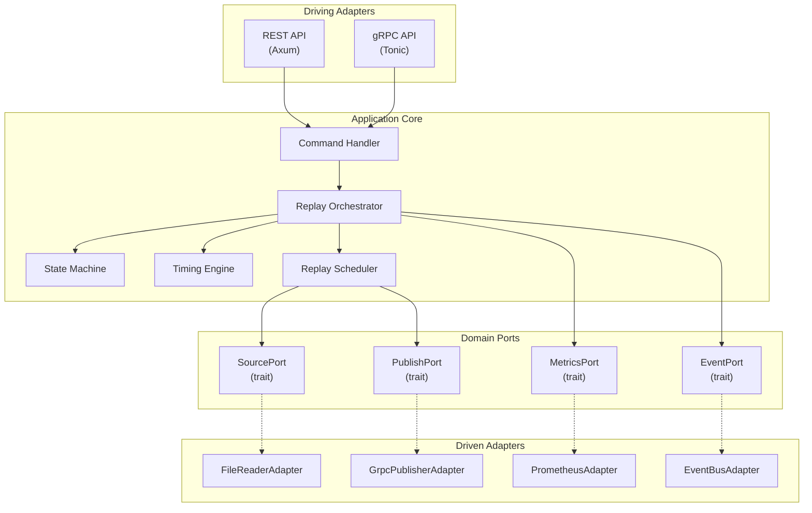

# MuST Replay Simulator Service — Architecture Document

| Field              | Value                                    |
|--------------------|------------------------------------------|
| **Document ID**    | MUST-SIM-ARCH-002                        |
| **Version**        | 1.0.0-DRAFT                             |
| **Date**           | 2026-07-03                               |
| **Status**         | DRAFT — PENDING REVIEW                   |

---

## 1. Architecture Philosophy

### 1.1 Why Hexagonal Architecture

The Replay Simulator Service uses **Hexagonal Architecture** (Ports & Adapters, Alistair Cockburn, 2005) for a single critical reason: **the input source will change**.

Today the source is a file. Tomorrow it is a TCP receiver. Next quarter it is an SDR. The domain logic — state management, timing, scheduling — must remain invariant across all source types. Hexagonal architecture enforces this by:

1. **Defining Ports** — abstract interfaces (Rust traits) that the domain depends on.
2. **Implementing Adapters** — concrete implementations that satisfy ports.
3. **Isolating the Domain** — the replay engine never imports adapter code.

This is not architectural aesthetics. This is a **contractual requirement**: the RSS must be replaceable by a live receiver without changing any downstream service (SRS: FR-040 through FR-042).

### 1.2 Layer Diagram

```
┌─────────────────────────────────────────────────────────────────────┐
│                        DRIVING ADAPTERS (Input)                     │
│  ┌─────────────┐  ┌──────────────┐  ┌───────────────────────────┐  │
│  │  REST API   │  │  gRPC API    │  │  CLI (future)             │  │
│  │  (Axum)     │  │  (Tonic)     │  │                           │  │
│  └──────┬──────┘  └──────┬───────┘  └────────────┬──────────────┘  │
│         │               │                       │                   │
│         └───────────────┼───────────────────────┘                   │
│                         │                                           │
│                    ┌────▼────┐                                      │
│                    │  PORTS  │  (Command Port, Query Port)          │
│                    └────┬────┘                                      │
├─────────────────────────┼───────────────────────────────────────────┤
│                    APPLICATION LAYER                                 │
│  ┌──────────────────────▼──────────────────────────────────┐        │
│  │              Replay Orchestrator                         │        │
│  │  ┌─────────────┐ ┌──────────────┐ ┌──────────────────┐ │        │
│  │  │ State Machine│ │Timing Engine │ │ Replay Scheduler │ │        │
│  │  └─────────────┘ └──────────────┘ └──────────────────┘ │        │
│  └──────────────────────┬──────────────────────────────────┘        │
│                         │                                           │
│                    ┌────▼────┐                                      │
│                    │  PORTS  │  (Source Port, Publish Port,         │
│                    │         │   Metrics Port, Event Port)          │
│                    └────┬────┘                                      │
├─────────────────────────┼───────────────────────────────────────────┤
│                    DRIVEN ADAPTERS (Output)                          │
│  ┌──────────────┐ ┌──────────────┐ ┌────────────┐ ┌────────────┐  │
│  │ File Reader  │ │ RabbitMQ     │ │ Prometheus │ │ RabbitMQ   │  │
│  │ (Source)     │ │ Publisher    │ │ (Metrics)  │ │ Events     │  │
│  └──────────────┘ └──────────────┘ └────────────┘ └────────────┘  │
└─────────────────────────────────────────────────────────────────────┘
```

### 1.3 Why This Layering

| Layer          | Responsibility | What it NEVER does |
|----------------|---------------|-------------------|
| Driving Adapters | Translate HTTP/gRPC requests into domain commands | Make domain decisions |
| Application | Orchestrate domain operations, enforce state machine | Know about HTTP, files, or gRPC |
| Driven Adapters | Implement I/O against external systems | Contain business logic |

---

## 2. Component Architecture

### 2.1 Component Diagram



### 2.2 Component Responsibilities

#### Replay Orchestrator
**Purpose:** Central coordinator. Receives commands, delegates to sub-components, enforces invariants.

**Why it exists:** A single coordination point prevents race conditions between the state machine, timing engine, and scheduler. Without it, each component would need to know about the others — violating separation of concerns.

**Key behaviors:**
- Receives validated commands from the Command Handler
- Queries the FSM for transition validity before executing
- Delegates timing operations to the Timing Engine
- Delegates packet reading/scheduling to the Replay Scheduler
- Publishes events through the EventPort

#### State Machine (FSM)
**Purpose:** Maintains the current playback state and validates transitions.

**Why it exists:** Aerospace systems require deterministic state management. Every command must be validated against the current state before execution. Ad-hoc boolean flags lead to impossible state combinations.

**States:** IDLE, READY, RUNNING, PAUSED, STOPPED, COMPLETED, ERROR

(Full state machine specification in `05_StateMachine.md`)

#### Timing Engine
**Purpose:** Manages the logical replay clock, computes inter-packet delays, applies speed multipliers, handles drift correction.

**Why it exists:** Timing fidelity is the core value proposition. A dedicated engine isolates the complex clock arithmetic from packet reading and publishing.

**Key behaviors:**
- Maintains a logical clock (not wall-clock)
- Computes `actual_delay = original_delay / speed_multiplier`
- Tracks cumulative drift and applies corrections
- Freezes on PAUSE, resumes on RESUME without discontinuity
- Resets on SEEK to target timestamp

#### Replay Scheduler
**Purpose:** Reads packets from the source, computes when each should be published, and dispatches them at the correct time.

**Why it exists:** Separates the "what to send" (packet reading) from "when to send" (timing). The scheduler is the integration point between SourcePort (input) and PublishPort (output).

**Key behaviors:**
- Reads next packet via SourcePort
- Queries Timing Engine for computed delay
- Sleeps for the delay duration (Tokio sleep)
- Publishes via PublishPort
- Updates counters and progress

#### Command Handler
**Purpose:** Validates, deserializes, and routes incoming commands from driving adapters.

**Why it exists:** Driving adapters should not contain validation logic. The Command Handler normalizes inputs from REST and gRPC into a single domain command type.

---

## 3. Port Definitions (Traits)

### 3.1 SourcePort (Driven — Input)

```
trait SourcePort {
    fn open(path) -> Result<SourceMetadata>
    fn read_next_packet() -> Result<Option<ReplayPacket>>
    fn seek(timestamp) -> Result<()>
    fn position() -> SourcePosition
    fn close() -> Result<()>
    fn metadata() -> SourceMetadata
}
```

**Why this interface:**
- `open()` + `close()` — resource lifecycle management
- `read_next_packet()` returns `Option` — `None` signals EOF naturally
- `seek()` — required for SEEK command and loop restart
- `position()` — required for progress reporting
- `metadata()` — required for status queries and progress calculation

**Current Adapter:** `FileReaderAdapter` (binary and CCSDS files)

**Future Adapters:** `TcpReceiverAdapter`, `UdpReceiverAdapter`, `SerialAdapter`, `GnuRadioAdapter`, `SdrAdapter`

### 3.2 PublishPort (Driven — Output)

```
trait PublishPort {
    fn publish(envelope: TelemetryEnvelope) -> Result<()>
    fn is_connected() -> bool
    fn backpressure_status() -> BackpressureStatus
}
```

**Why this interface:**
- `publish()` — publishes a TelemetryEnvelope to RabbitMQ (`telemetry.raw` exchange) with a topic routing key built from envelope fields (ADR-001/006).
- `is_connected()` — health check before publishing.
- `backpressure_status()` — when the RabbitMQ channel is blocked or the bounded internal buffer is full, the Scheduler PAUSES (ADR-003). No packets are dropped. The Timing Engine offsets session_start by the pause duration, identical to operator-initiated PAUSE.

### 3.3 EventPort (Driven — Output)

```
trait EventPort {
    fn emit(event: ReplayEvent) -> Result<()>
}
```

**Why minimal:** Events are fire-and-forget from the domain perspective. The adapter decides delivery semantics (gRPC stream, channel, message queue).

### 3.4 MetricsPort (Driven — Output)

```
trait MetricsPort {
    fn record_packets_published(count: u64)
    fn record_timing_jitter(jitter_ns: i64)
    fn record_command(command: &str, success: bool)
    fn set_playback_state(state: &str)
    fn set_playback_speed(speed: f64)
    fn set_progress(progress: f64)
}
```

**Why explicit methods:** Rather than a generic `record(name, value)`, explicit methods enforce metric naming consistency at compile time.

---

## 4. Packet Flow Pipeline

```
┌──────────────┐    ┌──────────────┐    ┌──────────────────┐    ┌──────────────┐    ┌──────────────────┐    ┌──────────────────┐
│ Replay File  │───>│ Packet Reader│───>│ Replay Scheduler │───>│ Timing Engine│───>│ Packet Publisher  │───>│ Telemetry Gateway│
│              │    │              │    │                  │    │              │    │                  │    │                  │
│ .bin / .ccsds│    │ SourcePort   │    │ Orchestration    │    │ Delay Calc   │    │ PublishPort      │    │ Downstream       │
└──────────────┘    └──────────────┘    └──────────────────┘    └──────────────┘    └──────────────────┘    └──────────────────┘
```

### Stage-by-Stage Explanation

**Stage 1: Replay File**
- Raw binary or CCSDS packet file on disk.
- File is memory-mapped or streamed via buffered I/O (configurable).
- WHY: The file is the ground truth recording. It is never modified.

**Stage 2: Packet Reader (SourcePort adapter)**
- Reads raw bytes and frames them into discrete `ReplayPacket` structures.
- For CCSDS: parses the 6-byte primary header, extracts APID, sequence count, and packet length.
- For binary: uses sync-word detection and length fields.
- Validates packet structure (header CRC, length bounds).
- WHY: Framing and validation must happen before the domain processes packets. Invalid packets are rejected at the boundary.

**Stage 3: Replay Scheduler**
- Receives framed packets from the reader.
- Extracts the packet timestamp (from secondary header or file index).
- Computes the delta between current packet timestamp and previous packet timestamp.
- Passes delta to Timing Engine for delay calculation.
- WHY: The scheduler is the control loop. It determines "what" and "when".

**Stage 4: Timing Engine**
- Receives the original inter-packet delta.
- Applies speed multiplier: `actual_delay = delta / speed`
- Applies drift correction: adjusts delay based on cumulative timing error.
- Returns the computed sleep duration.
- WHY: Isolating timing arithmetic into a dedicated component makes it independently testable and auditable.

**Stage 5: Packet Publisher (PublishPort adapter)**
- Wraps the raw packet in a `TelemetryEnvelope` (using the shared contract from `must.telemetry.v1`).
- Publishes via RabbitMQ to `telemetry.raw` exchange with routing key `{mission}.{satellite}.{apid}.raw` (ADR-001/006).
- If the RabbitMQ channel is blocked (backpressure), the scheduler pauses — no packets are dropped (ADR-003).
- WHY: RabbitMQ enables fan-out to multiple consumers (Gateway, CCSDS, Archive) without the publisher knowing about them.

**Stage 6: Downstream Services**
- Multiple services consume from `telemetry.raw`: Gateway, CCSDS Service, Archive Service.
- They subscribe via RabbitMQ queue bindings. Not part of the RSS.
- WHY: The RSS publishes once. RabbitMQ routes to all subscribers. RSS does not need to know how many consumers exist or what they do.

---

## 5. Timing Engine — Detailed Design

### 5.1 Clock Model

The Timing Engine maintains a **logical clock** that represents the current position in the recording timeline.

```
replay_clock = file_start_timestamp + elapsed_replay_time
```

**Why logical clock:** The RSS cannot use wall-clock time because:
1. NTP corrections can jump the clock forward or backward.
2. System clock granularity varies across platforms.
3. Logical clocks enable deterministic testing.

The logical clock uses `tokio::time::Instant` (monotonic) for measuring real elapsed time, and `Duration` for computing delays.

### 5.2 Speed-Adjusted Timing

Given two consecutive packets with original timestamps `T_n` and `T_{n+1}`:

```
original_delta = T_{n+1} - T_n
actual_delay = original_delta / speed_multiplier
```

Example at 4x speed:
```
Original gap: 100ms
Actual delay: 100ms / 4 = 25ms
```

**Why division:** Speed is defined as "how much faster than real-time." Multiplying would make it slower.

### 5.3 Drift Correction

Over thousands of packets, processing overhead accumulates:

```
expected_elapsed = sum(all actual_delays so far)
real_elapsed = monotonic_now - session_start
drift = real_elapsed - expected_elapsed
```

If `drift > 0` (running slow), subtract drift from next delay.
If `drift < 0` (running fast — rare), add to next delay.
If correction would make delay negative, set delay to 0 (catch-up mode).

**Why drift correction:** Without it, a 1-hour replay at 1x would accumulate seconds of error. NASA flight software timing systems use identical correction models (see NASA-HDBK-1002).

### 5.4 Pause Behavior

On PAUSE:
1. Record `pause_instant = monotonic_now`
2. Cancel pending sleep
3. Freeze logical clock

On RESUME:
1. Record `resume_instant = monotonic_now`
2. Compute `pause_duration = resume_instant - pause_instant`
3. Offset `session_start` by `pause_duration` (so drift calculation ignores pause time)
4. Re-calculate delay for current packet using remaining time

**Why offset session_start:** If we don't account for pause duration, the drift correction will think we're running slow by the entire pause duration and try to catch up by dropping delays.

### 5.5 Seek Behavior

On SEEK to target_timestamp:
1. Command the SourcePort to seek to the target timestamp
2. Reset logical clock: `replay_clock = target_timestamp`
3. Reset drift accumulators
4. Reset `session_start = monotonic_now`
5. Read next packet from new position
6. Resume normal scheduling

**Why full reset:** Seek creates a discontinuity. Carrying over drift state from before the seek would corrupt timing after the seek.

---

## 6. Error Handling Architecture

### 6.1 Error Classification

| Category | Examples | Severity | Recovery |
|----------|----------|----------|----------|
| Configuration | Missing config, invalid YAML | Fatal | Cannot start. Exit with diagnostic. |
| File I/O | Missing file, permission denied | Unrecoverable | Transition to ERROR state. Operator must fix and reload. |
| Packet Corruption | Invalid CCSDS header, bad CRC | Recoverable | Log, increment error counter, skip packet, continue. |
| Timestamp Corruption | Non-monotonic timestamps, overflow | Recoverable | Use previous timestamp + minimum delta. Log warning. |
| EOF | End of file reached | Normal | Transition to COMPLETED (or loop restart if LOOP enabled). |
| Memory | Allocation failure | Unrecoverable | Transition to ERROR state. Log memory stats. |
| Command | Invalid state transition | Rejected | Return error response. State unchanged. |
| Network | Publisher connection lost | Recoverable | Buffer briefly, retry, then ERROR if persistent. |

### 6.2 Error Propagation

```
Adapter Error → Result<T, AdapterError>
    ↓ map to
Domain Error → Result<T, DomainError>
    ↓ handled by
Orchestrator → state transition + event emission
    ↓ reported via
API → structured error response to caller
```

**Why this chain:** Each layer has its own error type. Adapters should not leak implementation details (e.g., `io::Error`) into the domain. The domain classifies errors by severity and recovery strategy.

---

## 7. Project Structure

```
simulator-engine/
│
├── docs/                              # Design documentation (you are here)
│   ├── 01_SRS.md
│   ├── 02_Architecture.md
│   ├── 03_API.md
│   ├── 04_Sequence.md
│   ├── 05_StateMachine.md
│   ├── 06_Deployment.md
│   ├── 07_TestPlan.md
│   └── 08_Acceptance.md
│
├── proto/                             # Protobuf definitions (API-first)
│   ├── replay/
│   │   └── v1/
│   │       ├── replay_service.proto   # gRPC service definition
│   │       ├── telemetry.proto        # Packet and envelope messages
│   │       └── events.proto           # Event messages
│   └── buf.yaml                       # Buf schema registry config
│
├── src/
│   ├── main.rs                        # Entry point: config, DI, server startup
│   │
│   ├── domain/                        # Pure domain logic (no I/O, no frameworks)
│   │   ├── mod.rs
│   │   ├── state_machine.rs           # FSM: states, transitions, validation
│   │   ├── timing_engine.rs           # Clock, delay computation, drift correction
│   │   ├── replay_scheduler.rs        # Packet scheduling loop
│   │   ├── models.rs                  # TimestampedPacket, TelemetryEnvelope, etc.
│   │   ├── commands.rs                # Command enum and validation
│   │   ├── events.rs                  # Event types
│   │   └── errors.rs                  # Domain error types
│   │
│   ├── application/                   # Use cases / orchestration
│   │   ├── mod.rs
│   │   ├── orchestrator.rs            # Replay Orchestrator (central coordinator)
│   │   └── command_handler.rs         # Command validation and routing
│   │
│   ├── ports/                         # Port trait definitions
│   │   ├── mod.rs
│   │   ├── source_port.rs             # SourcePort trait
│   │   ├── publish_port.rs            # PublishPort trait
│   │   ├── event_port.rs              # EventPort trait
│   │   └── metrics_port.rs            # MetricsPort trait
│   │
│   ├── adapters/                      # Concrete implementations
│   │   ├── mod.rs
│   │   ├── inbound/                   # Driving adapters
│   │   │   ├── mod.rs
│   │   │   ├── rest_api.rs            # Axum REST handlers
│   │   │   └── grpc_api.rs            # Tonic gRPC service impl
│   │   │
│   │   └── outbound/                  # Driven adapters
│   │       ├── mod.rs
│   │       ├── file_reader/           # File-based SourcePort
│   │       │   ├── mod.rs
│   │       │   ├── binary_reader.rs   # Raw binary file reader
│   │       │   ├── ccsds_reader.rs    # CCSDS packet file reader
│   │       │   └── timestamp_index.rs # Eager timestamp index (ADR-002)
│   │       ├── grpc_publisher.rs      # gRPC streaming (control + telemetry query)
│   │       ├── rabbitmq_publisher.rs   # RabbitMQ AMQP publisher (telemetry.raw)
│   │       ├── rabbitmq_events.rs      # RabbitMQ AMQP event publisher (must.events)
│   │       ├── prometheus_metrics.rs  # Prometheus MetricsPort
│   │       └── event_bus.rs           # Event publishing adapter
│   │
│   ├── config/                        # Configuration
│   │   ├── mod.rs
│   │   └── settings.rs               # YAML + env var config struct
│   │
│   └── telemetry/                     # Observability setup
│       ├── mod.rs
│       ├── logging.rs                 # tracing subscriber setup
│       └── metrics.rs                 # Prometheus registry setup
│
├── configs/
│   ├── default.yaml                   # Default configuration
│   ├── development.yaml               # Dev overrides
│   └── production.yaml                # Production overrides
│
├── tests/
│   ├── integration/                   # Integration tests
│   │   ├── test_playback.rs
│   │   ├── test_rest_api.rs
│   │   ├── test_grpc_api.rs
│   │   └── test_timing.rs
│   ├── fixtures/                      # Test data files
│   │   ├── sample_ccsds.bin
│   │   └── sample_raw.bin
│   └── mocks/                         # Mock adapters for testing
│       ├── mock_source.rs
│       └── mock_publisher.rs
│
├── scripts/
│   ├── generate_test_data.py          # Generate synthetic telemetry files
│   └── run_integration_tests.sh
│
├── Cargo.toml
├── Cargo.lock
├── Dockerfile
├── docker-compose.yml
├── .dockerignore
├── .gitignore
├── rust-toolchain.toml
└── README.md
```

### Why This Structure

| Directory | Rationale |
|-----------|-----------|
| `domain/` | Pure business logic. Zero external dependencies. If you `grep` for `use tokio` or `use tonic` here, something is wrong. |
| `ports/` | Trait definitions only. No implementations. This is the contract boundary. |
| `adapters/inbound/` | Driving adapters translate external requests into domain commands. |
| `adapters/outbound/` | Driven adapters implement ports against real infrastructure. |
| `application/` | Orchestration layer that composes domain objects and ports. |
| `proto/` | API-first: protobuf definitions exist before any Rust code. |
| `tests/mocks/` | Mock adapters enable domain testing without real I/O. |

---

## 8. Dependency Injection

Rust does not have a DI framework. We use **constructor injection** via generics and trait bounds:

```
struct ReplayOrchestrator<S: SourcePort, P: PublishPort, E: EventPort, M: MetricsPort> {
    source: S,
    publisher: P,
    events: E,
    metrics: M,
    state_machine: StateMachine,
    timing_engine: TimingEngine,
}
```

**Why generics over `dyn Trait`:**
- Zero-cost abstraction (monomorphization, no vtable dispatch).
- Compile-time enforcement of port contracts.
- `dyn Trait` reserved for cases where runtime polymorphism is actually needed (e.g., selecting source adapter at startup based on config).

**Assembly in `main.rs`:**
```
fn main():
    load config
    create FileReaderAdapter (implements SourcePort)
    create GrpcPublisherAdapter (implements PublishPort)
    create EventBusAdapter (implements EventPort)
    create PrometheusAdapter (implements MetricsPort)
    create ReplayOrchestrator with all adapters
    start REST server (Axum) with orchestrator handle
    start gRPC server (Tonic) with orchestrator handle
    await shutdown signal
```

---

## 9. Concurrency Model

### 9.1 Task Architecture

```
┌──────────────────────────────────────────────────┐
│                 Tokio Runtime                     │
│                                                  │
│  ┌────────────────┐   ┌────────────────────────┐ │
│  │ REST Server    │   │ gRPC Server            │ │
│  │ (Axum task)    │   │ (Tonic task)           │ │
│  └───────┬────────┘   └───────┬────────────────┘ │
│          │                    │                   │
│          └────────┬───────────┘                   │
│                   │                               │
│          ┌────────▼────────┐                      │
│          │ Command Channel │ (tokio::mpsc)        │
│          └────────┬────────┘                      │
│                   │                               │
│          ┌────────▼────────┐                      │
│          │ Orchestrator    │                      │
│          │ Task            │ (single task, owns   │
│          │                 │  all mutable state)  │
│          └────────┬────────┘                      │
│                   │                               │
│          ┌────────▼────────┐                      │
│          │ Scheduler Task  │ (spawned per session)│
│          │ (read → time →  │                      │
│          │  publish loop)  │                      │
│          └─────────────────┘                      │
└──────────────────────────────────────────────────┘
```

### 9.2 Why Single-Orchestrator

The orchestrator runs as a single Tokio task that owns all mutable state (FSM, timing engine, counters). Commands arrive via an `mpsc` channel. This eliminates the need for locks:

- No `Mutex` on state machine
- No `RwLock` on timing engine
- No race conditions between concurrent commands
- Command ordering is preserved by the channel

**Why not actor framework:** Tokio channels provide sufficient actor-like behavior. Adding Actix or similar frameworks introduces unnecessary dependency weight for a single-actor system.

---

## 10. Configuration Architecture

```yaml
# configs/default.yaml
server:
  rest:
    host: "0.0.0.0"
    port: 8080
  grpc:
    host: "0.0.0.0"
    port: 50051

replay:
  default_speed: 1.0
  max_speed: 32.0
  io_buffer_size_bytes: 8388608  # 8 MB
  drift_correction_enabled: true
  drift_correction_interval_packets: 1000
  max_packet_size_bytes: 65542
  file_base_directory: "/data/telemetry"

publisher:
  downstream_address: "telemetry-gateway:50052"
  buffer_size: 1024
  retry_attempts: 3
  retry_delay_ms: 100

observability:
  log_level: "info"
  log_format: "json"
  metrics_port: 9090

health:
  startup_timeout_seconds: 30
```

**Why YAML + env overrides:** YAML provides structured, readable configuration for development. Environment variables (e.g., `MUST_SERVER_REST_PORT=8080`) enable container orchestration without config file mounts.

---

## 11. Revision History

| Version | Date       | Description    |
|---------|------------|----------------|
| 1.0.0   | 2026-07-03 | Initial draft  |
