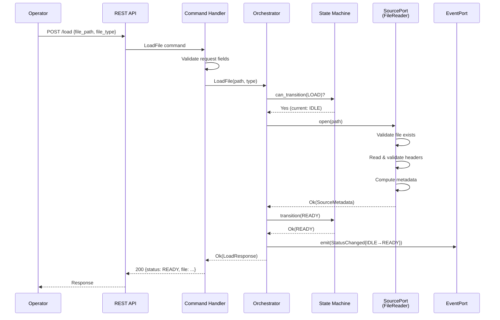
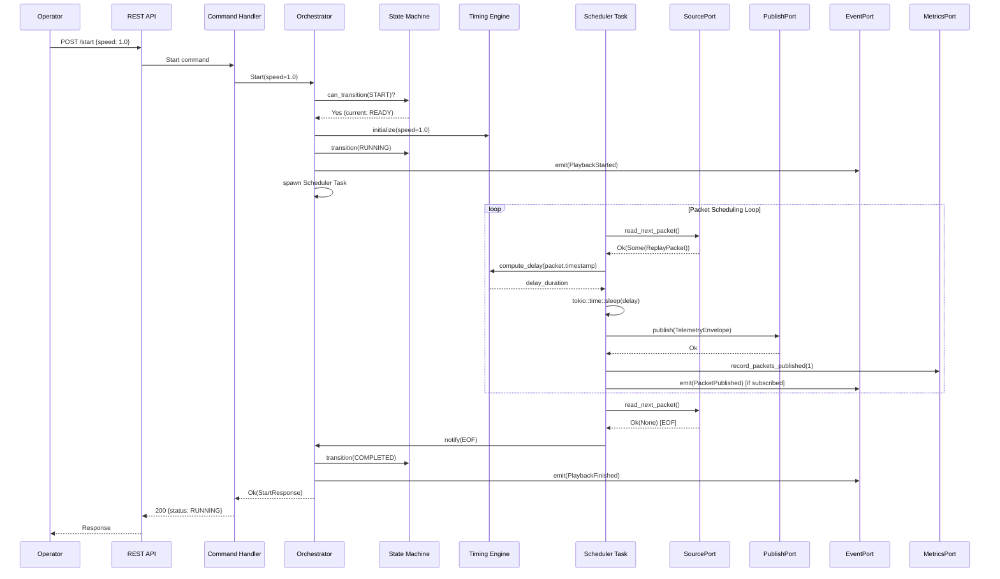
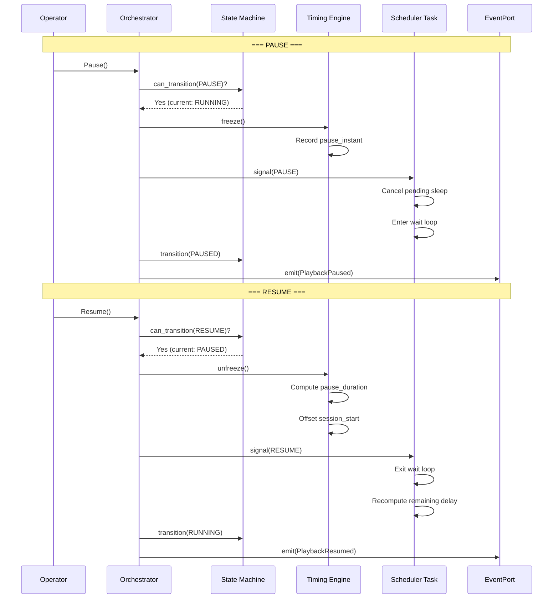
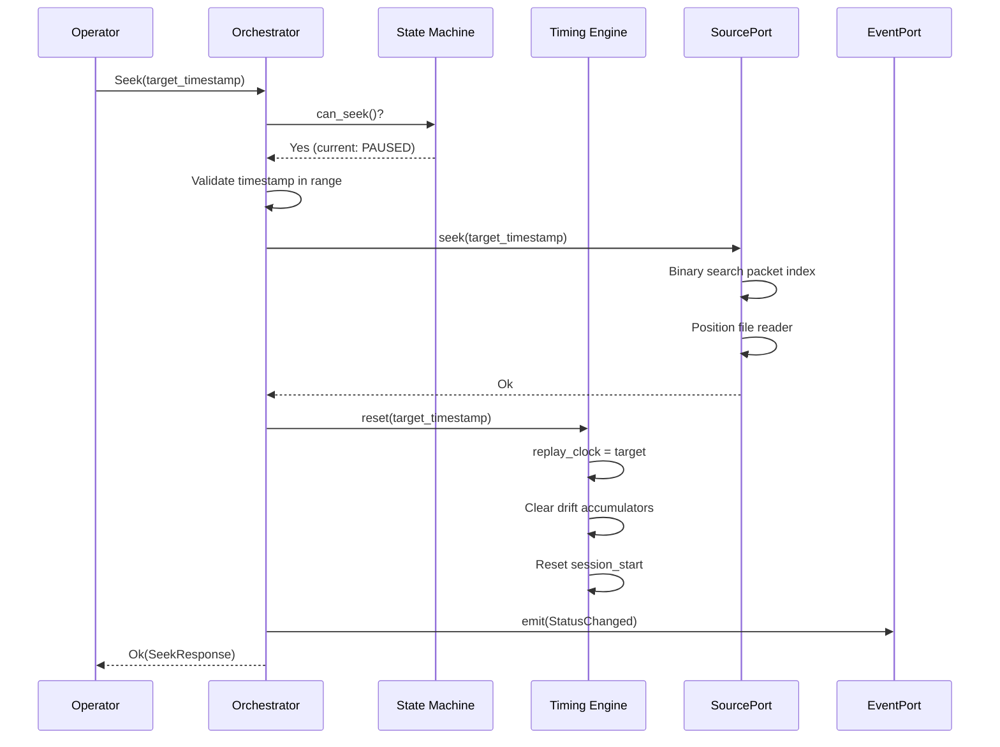
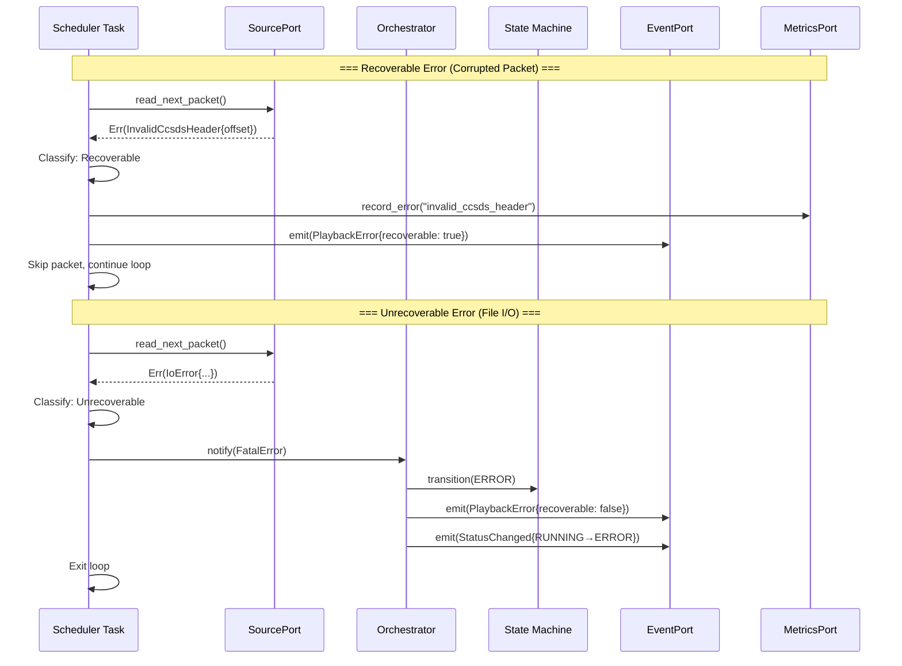
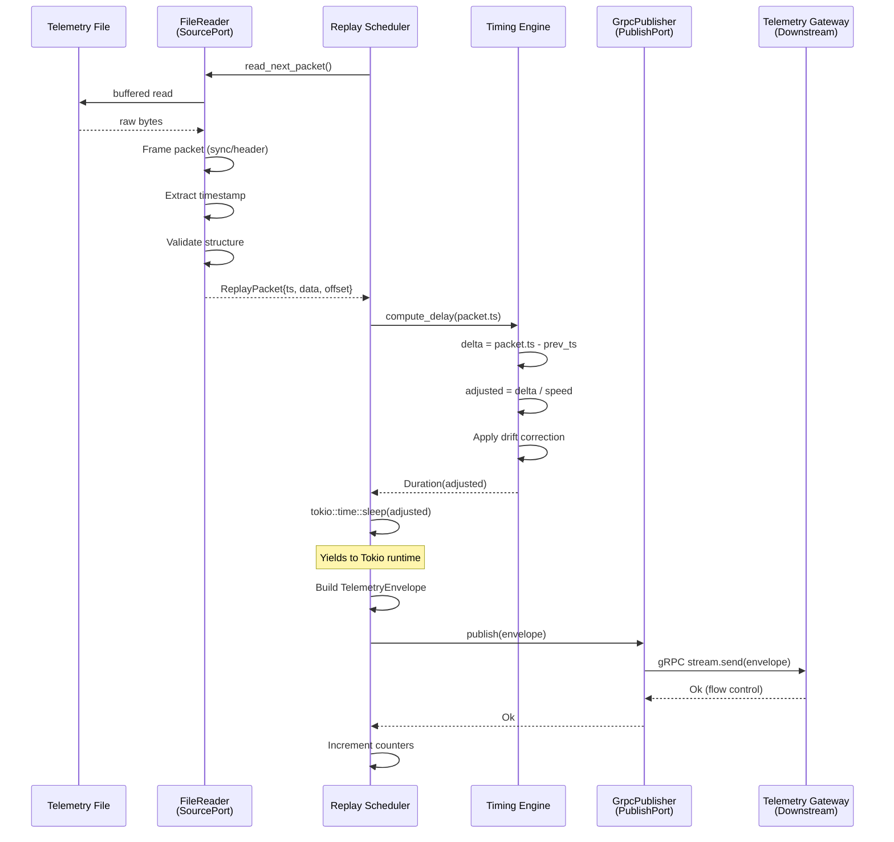
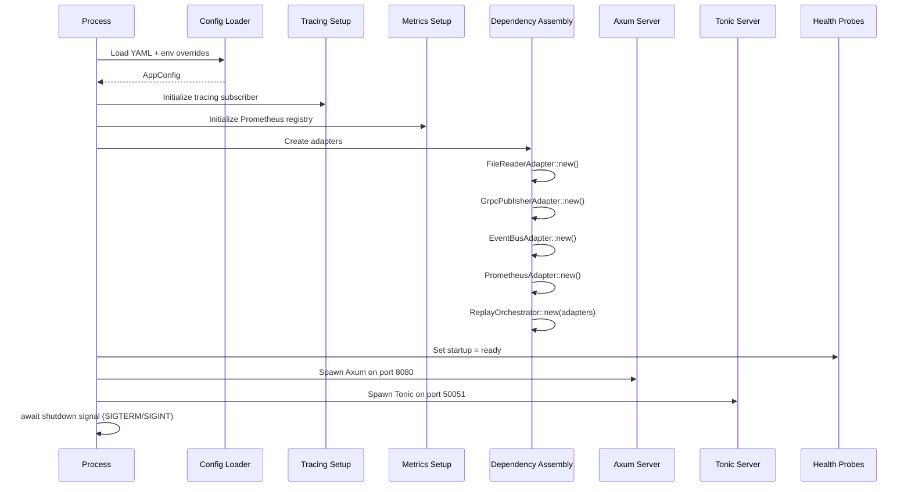
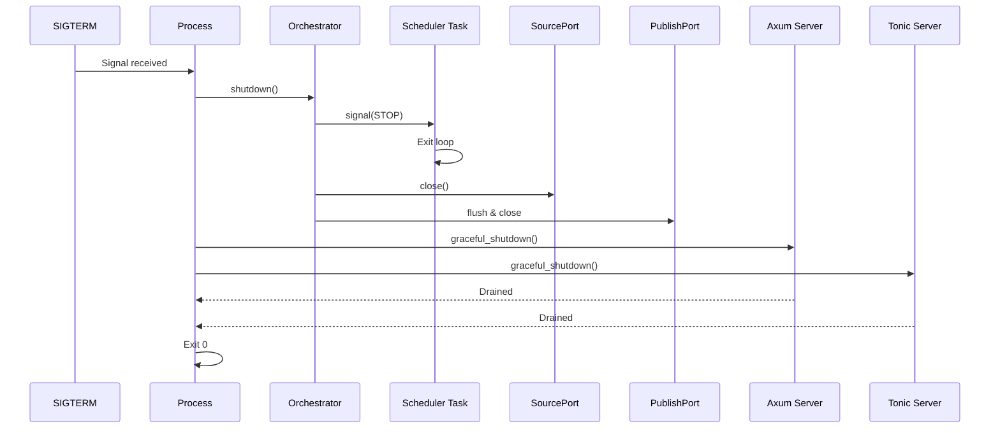

# MuST Replay Simulator Service — Sequence Diagrams

| Field              | Value                                    |
|--------------------|------------------------------------------|
| **Document ID**    | MUST-SIM-SEQ-004                         |
| **Version**        | 1.0.0-DRAFT                             |
| **Date**           | 2026-07-03                               |
| **Status**         | DRAFT — PENDING REVIEW                   |

---

## 1. Load File Sequence

This is the initialization sequence. An operator loads a telemetry file, which transitions the system from IDLE to READY.

**Design Rationale:**
- File validation happens inside the SourcePort adapter, not in the domain. WHY: the domain does not know what constitutes a valid binary vs. CCSDS file.
- State transition happens AFTER successful file open. WHY: if the file is invalid, we must stay in IDLE, not transition and then fail.
- Metadata is computed eagerly. WHY: operators need packet count and duration estimates in the load response.

---

## 2. Start Playback Sequence

Transitions from READY to RUNNING and begins the packet scheduling loop.

**Design Rationale:**
- The Scheduler runs as a separate Tokio task. WHY: the REST response returns immediately after spawning. The operator does not wait for playback to complete.
- `tokio::time::sleep` is used for inter-packet delay. WHY: it yields the task, allowing other async work (command handling) to proceed.
- PacketPublished events are optional (subscriber-gated). WHY: at 100K pkt/s, unconditional event emission would overwhelm the event system.

---

## 3. Pause / Resume Sequence

**Design Rationale:**
- Pause cancels the current sleep rather than waiting for it to complete. WHY: instant pause response. If a sleep was 30 seconds (low-rate data), the operator would wait 30 seconds otherwise.
- The remaining delay for the current packet is recomputed on resume. WHY: if we paused 5s into a 10s sleep, we must only sleep 5s more, not restart the full 10s.

---

## 4. Seek Sequence

**Design Rationale:**
- Seek is only allowed in PAUSED, READY, or STOPPED states. WHY: seeking while RUNNING would create a race condition between the scheduler reading packets and the seek repositioning the reader.
- The timing engine performs a full reset. WHY: drift state from before the seek is meaningless after the discontinuity.
- The SourcePort uses binary search for seek. WHY: linear scan of a 64 GB file would be unacceptably slow. Packet timestamps are monotonically increasing (invariant), enabling binary search.

---

## 5. Error Recovery Sequence

**Design Rationale:**
- Error classification happens at the boundary (Scheduler), not in the adapter. WHY: the same adapter error (e.g., read failure) might be recoverable in one context (single bad sector) but unrecoverable in another (disk offline).
- Recoverable errors do not involve the orchestrator. WHY: the scheduler handles them locally to avoid synchronization overhead on the hot path.

---

## 6. Full Packet Flow Sequence (Hot Path)

This is the steady-state packet flow during RUNNING. This path executes for every single packet.

**Performance Note:** This sequence executes up to 100,000 times per second at 32x speed. Every allocation, lock, and system call on this path must be justified.

---

## 7. Startup Sequence

---

## 8. Shutdown Sequence

**Design Rationale:**
- Graceful shutdown ensures in-flight packets are published before exit. WHY: abrupt termination could leave the downstream gateway with an incomplete stream.
- Source is closed to release file handles. WHY: leaked file handles in a containerized environment can exhaust the PID's fd limit on restart.

---

## 9. Revision History

| Version | Date       | Description    |
|---------|------------|----------------|
| 1.0.0   | 2026-07-03 | Initial draft  |
