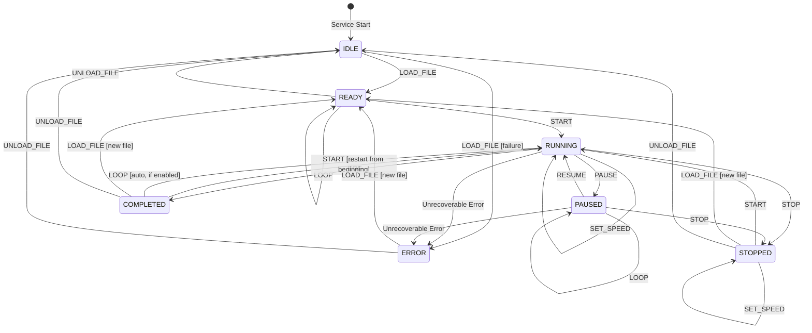

# MuST Replay Simulator Service — State Machine Document

| Field              | Value                                    |
|--------------------|------------------------------------------|
| **Document ID**    | MUST-SIM-FSM-005                         |
| **Version**        | 1.0.0-DRAFT                             |
| **Date**           | 2026-07-03                               |
| **Status**         | DRAFT — PENDING REVIEW                   |

---

## 1. State Machine Philosophy

The RSS uses a **deterministic finite state machine** (FSM) to govern all operational behavior. Every command is validated against the current state before execution. Invalid transitions are rejected with a diagnostic error — never silently ignored.

**Why a formal FSM:**
1. **Aerospace safety:** Undefined states cause mission-critical failures. ECSS-E-ST-40C mandates explicit state management for operational software.
2. **Testability:** Every valid transition is enumerable. Every invalid transition is enumerable. 100% state coverage is achievable.
3. **Debuggability:** At any point, the system can report its exact state and the commands that led to it.
4. **Auditability:** State transition logs provide a complete operational timeline.

---

## 2. State Definitions

| State       | Description | Invariants |
|-------------|-------------|------------|
| **IDLE**    | Service started, no file loaded. Waiting for LOAD command. | No source open. No file metadata available. No scheduler task. |
| **READY**   | File loaded and validated. Ready to begin playback. | Source open. Metadata available. File position at start (or seek target). No scheduler running. |
| **RUNNING** | Actively replaying packets to downstream. | Scheduler task running. Timing engine active. Packets being published. |
| **PAUSED**  | Playback temporarily suspended. Clock frozen. | Scheduler task waiting. Timing engine frozen. File position preserved. No packets being published. |
| **STOPPED** | Playback explicitly stopped by operator. | Scheduler task terminated. File still loaded. Position reset to beginning. Source remains open. |
| **COMPLETED** | Playback reached end of file (EOF). | Scheduler task terminated. All packets published. Source remains open. |
| **ERROR**   | Unrecoverable error encountered. | Scheduler task terminated. Source may be in undefined state. Operator intervention required. |

### Why These Specific States

| Design Decision | Rationale |
|----------------|-----------|
| IDLE vs READY separation | IDLE has no file. READY has a validated file. This distinction prevents "start without file" bugs at compile time (state-driven validation). |
| STOPPED vs COMPLETED | STOPPED is operator-initiated (explicit stop). COMPLETED is system-initiated (EOF). Different states enable different UX: COMPLETED can trigger auto-actions (loop restart). STOPPED cannot. |
| ERROR as terminal | ERROR requires explicit recovery (LOAD or UNLOAD). Allowing auto-recovery from ERROR masks systemic issues. Operator must acknowledge and address the root cause. |
| No LOADING state | File loading is synchronous (< 2s per NFR-012). A transient LOADING state adds FSM complexity without operational value. If loading becomes slow, we add it. |

---

## 3. State Diagram

---

## 4. Transition Table

This is the authoritative reference. Implementation MUST match this table exactly.

| Current State | Command      | Guard Condition                   | Next State | Side Effects |
|--------------|--------------|-----------------------------------|------------|--------------|
| IDLE         | LOAD_FILE    | File exists, valid format         | READY      | Open source, compute metadata, emit StatusChanged |
| IDLE         | LOAD_FILE    | File missing or invalid           | ERROR      | Emit PlaybackError, emit StatusChanged |
| IDLE         | GET_STATUS   | —                                 | IDLE       | Return current status |
| IDLE         | (any other)  | —                                 | REJECTED   | Return INVALID_STATE error |
| READY        | START        | —                                 | RUNNING    | Init timing engine, spawn scheduler, emit PlaybackStarted |
| READY        | UNLOAD_FILE  | —                                 | IDLE       | Close source, clear metadata, emit StatusChanged |
| READY        | SEEK         | Timestamp in valid range          | READY      | Reposition source, reset timing, emit StatusChanged |
| READY        | SET_SPEED    | Speed in allowed set              | READY      | Update timing engine speed |
| READY        | LOOP         | —                                 | READY      | Update loop configuration |
| READY        | GET_STATUS   | —                                 | READY      | Return current status |
| READY        | (invalid)    | —                                 | REJECTED   | Return INVALID_STATE error |
| RUNNING      | PAUSE        | —                                 | PAUSED     | Freeze timing, pause scheduler, emit PlaybackPaused |
| RUNNING      | STOP         | —                                 | STOPPED    | Stop scheduler, reset position, emit StatusChanged |
| RUNNING      | SET_SPEED    | Speed in allowed set              | RUNNING    | Update timing engine speed dynamically |
| RUNNING      | GET_STATUS   | —                                 | RUNNING    | Return current status |
| RUNNING      | EOF          | End of file reached (internal)    | COMPLETED  | Stop scheduler, emit PlaybackFinished |
| RUNNING      | FATAL_ERROR  | (internal)                        | ERROR      | Stop scheduler, emit PlaybackError |
| RUNNING      | (invalid)    | —                                 | REJECTED   | Return INVALID_STATE error |
| PAUSED       | RESUME       | —                                 | RUNNING    | Unfreeze timing, resume scheduler, emit PlaybackResumed |
| PAUSED       | STOP         | —                                 | STOPPED    | Stop scheduler, reset position, emit StatusChanged |
| PAUSED       | SEEK         | Timestamp in valid range          | PAUSED     | Reposition source, reset timing, emit StatusChanged |
| PAUSED       | SET_SPEED    | Speed in allowed set              | PAUSED     | Update timing engine speed |
| PAUSED       | LOOP         | —                                 | PAUSED     | Update loop configuration |
| PAUSED       | GET_STATUS   | —                                 | PAUSED     | Return current status |
| PAUSED       | FATAL_ERROR  | (internal)                        | ERROR      | Stop scheduler, emit PlaybackError |
| PAUSED       | (invalid)    | —                                 | REJECTED   | Return INVALID_STATE error |
| STOPPED      | START        | —                                 | RUNNING    | Re-init timing, spawn scheduler from start, emit PlaybackStarted |
| STOPPED      | LOAD_FILE    | New file valid                    | READY      | Close old source, open new, emit StatusChanged |
| STOPPED      | UNLOAD_FILE  | —                                 | IDLE       | Close source, emit StatusChanged |
| STOPPED      | SEEK         | Timestamp in valid range          | STOPPED    | Reposition source |
| STOPPED      | SET_SPEED    | Speed in allowed set              | STOPPED    | Update speed for next start |
| STOPPED      | GET_STATUS   | —                                 | STOPPED    | Return current status |
| STOPPED      | (invalid)    | —                                 | REJECTED   | Return INVALID_STATE error |
| COMPLETED    | START        | —                                 | RUNNING    | Reset to start, spawn scheduler, emit PlaybackStarted |
| COMPLETED    | LOAD_FILE    | New file valid                    | READY      | Close old source, open new, emit StatusChanged |
| COMPLETED    | UNLOAD_FILE  | —                                 | IDLE       | Close source, emit StatusChanged |
| COMPLETED    | GET_STATUS   | —                                 | COMPLETED  | Return current status |
| COMPLETED    | (invalid)    | —                                 | REJECTED   | Return INVALID_STATE error |
| ERROR        | LOAD_FILE    | New file valid                    | READY      | Close old source (best-effort), open new, emit StatusChanged |
| ERROR        | UNLOAD_FILE  | —                                 | IDLE       | Close source (best-effort), emit StatusChanged |
| ERROR        | GET_STATUS   | —                                 | ERROR      | Return current status with error details |
| ERROR        | (invalid)    | —                                 | REJECTED   | Return INVALID_STATE error |

---

## 5. Command Specifications

### 5.1 LOAD_FILE

| Field | Value |
|-------|-------|
| Purpose | Load and validate a telemetry file for replay |
| Input | file_path (string), file_type (enum), timestamp_format (enum, optional) |
| Output | LoadResponse with file metadata |
| Valid From | IDLE, STOPPED, COMPLETED, ERROR |
| Transitions To | READY (success), ERROR (failure from IDLE) |
| Validation | Path must be within sandboxed directory. File must exist. File must pass format-specific header validation. |
| Error Cases | FILE_NOT_FOUND, INVALID_FILE, PATH_TRAVERSAL, PERMISSION_DENIED |

### 5.2 START

| Field | Value |
|-------|-------|
| Purpose | Begin or restart playback |
| Input | speed (float, optional), loop_enabled (bool, optional), stop_at_timestamp (uint64, optional) |
| Output | StartResponse with playback info |
| Valid From | READY, STOPPED, COMPLETED |
| Transitions To | RUNNING |
| Validation | Speed must be in allowed set. If from COMPLETED, resets to file start. |
| Error Cases | INVALID_SPEED, PUBLISHER_UNAVAILABLE |

### 5.3 STOP

| Field | Value |
|-------|-------|
| Purpose | Stop playback and reset position |
| Input | None |
| Output | StopResponse |
| Valid From | RUNNING, PAUSED |
| Transitions To | STOPPED |
| Validation | None (always valid from permitted states) |
| Error Cases | None (infallible from valid states) |

### 5.4 PAUSE

| Field | Value |
|-------|-------|
| Purpose | Suspend playback, freeze clock |
| Input | None |
| Output | PauseResponse with pause position |
| Valid From | RUNNING |
| Transitions To | PAUSED |
| Validation | None |
| Error Cases | None |

### 5.5 RESUME

| Field | Value |
|-------|-------|
| Purpose | Resume playback from paused position |
| Input | None |
| Output | ResumeResponse |
| Valid From | PAUSED |
| Transitions To | RUNNING |
| Validation | None |
| Error Cases | None |

### 5.6 SEEK

| Field | Value |
|-------|-------|
| Purpose | Jump to specific timestamp in file |
| Input | target_timestamp (uint64), mode (absolute/relative) |
| Output | SeekResponse with new position |
| Valid From | READY, PAUSED, STOPPED |
| Transitions To | (same state) |
| Validation | Timestamp must be within file time range. Mode must be valid. |
| Error Cases | TIMESTAMP_OUT_OF_RANGE, SEEK_FAILED |

### 5.7 SET_SPEED

| Field | Value |
|-------|-------|
| Purpose | Change playback speed |
| Input | speed (float) |
| Output | SpeedResponse with old and new speed |
| Valid From | READY, RUNNING, PAUSED, STOPPED |
| Transitions To | (same state) |
| Validation | Speed must be one of: 0.0 (step), 1.0, 2.0, 4.0, 8.0, 16.0, 32.0 |
| Error Cases | INVALID_SPEED |

### 5.8 LOOP

| Field | Value |
|-------|-------|
| Purpose | Enable/disable loop playback |
| Input | enabled (bool), max_iterations (uint32) |
| Output | LoopResponse |
| Valid From | READY, RUNNING, PAUSED, STOPPED, COMPLETED |
| Transitions To | (same state) |
| Validation | None |
| Error Cases | None |

### 5.9 UNLOAD_FILE

| Field | Value |
|-------|-------|
| Purpose | Close loaded file and return to IDLE |
| Input | None |
| Output | UnloadResponse |
| Valid From | READY, STOPPED, COMPLETED, ERROR |
| Transitions To | IDLE |
| Validation | Must not be RUNNING or PAUSED (stop first) |
| Error Cases | None (close is best-effort) |

### 5.10 GET_STATUS

| Field | Value |
|-------|-------|
| Purpose | Query current state and playback information |
| Input | None |
| Output | Full StatusResponse |
| Valid From | Any state |
| Transitions To | (no transition) |
| Validation | None |
| Error Cases | None |

---

## 6. State Invariant Verification

The FSM implementation SHALL verify these invariants on every transition:

| Invariant | Verified When | Action on Violation |
|-----------|--------------|-------------------|
| Source is open when entering READY | After LOAD_FILE | Transition to ERROR |
| Scheduler task handle exists when entering RUNNING | After START | Transition to ERROR |
| Timing engine is frozen when in PAUSED | After PAUSE | Panic (logic error) |
| Timing engine is active when in RUNNING | After START/RESUME | Panic (logic error) |
| No scheduler task exists in IDLE | After UNLOAD | Debug assertion |

**Why panic on some violations:** Invariant violations within the FSM itself indicate logic bugs, not runtime errors. These should crash the service to prevent undefined behavior. Runtime errors (file I/O, network) transition to ERROR instead.

---

## 7. Revision History

| Version | Date       | Description    |
|---------|------------|----------------|
| 1.0.0   | 2026-07-03 | Initial draft  |
