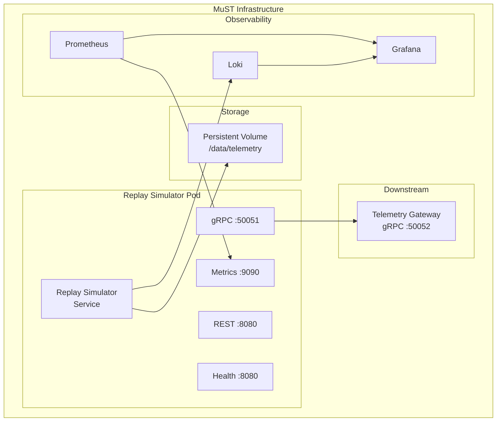

# MuST Replay Simulator Service — Deployment Document

| Field              | Value                                    |
|--------------------|------------------------------------------|
| **Document ID**    | MUST-SIM-DEP-006                         |
| **Version**        | 1.0.0-DRAFT                             |
| **Date**           | 2026-07-03                               |
| **Status**         | DRAFT — PENDING REVIEW                   |

---

## 1. Deployment Architecture

### 1.1 Component Diagram



### 1.2 Why This Topology

| Decision | Rationale |
|----------|-----------|
| Single container | RSS is a single-process service. Sidecar patterns add unnecessary complexity. |
| Persistent volume for telemetry files | Files are large (up to 64 GB). They must not be baked into the container image. Volume mount enables file management without redeployment. |
| Separate metrics port | Prometheus scraping should not compete with operational traffic on the REST port. |
| Direct gRPC to gateway | No message broker between RSS and gateway. WHY: telemetry streaming requires ordered, low-latency delivery. A broker adds latency and ordering complexity. |

---

## 2. Dockerfile

```dockerfile
# --- Build Stage ---
FROM rust:1.79-bookworm AS builder

WORKDIR /build

# Cache dependency compilation
COPY Cargo.toml Cargo.lock ./
RUN mkdir src && echo "fn main() {}" > src/main.rs
RUN cargo build --release && rm -rf src

# Build actual application
COPY . .
RUN cargo build --release

# --- Runtime Stage ---
FROM debian:bookworm-slim AS runtime

RUN apt-get update && apt-get install -y \
    ca-certificates \
    && rm -rf /var/lib/apt/lists/*

RUN groupadd -r must && useradd -r -g must -s /sbin/nologin must

COPY --from=builder /build/target/release/replay-simulator /usr/local/bin/
COPY configs/default.yaml /etc/must/config.yaml

RUN mkdir -p /data/telemetry && chown must:must /data/telemetry

USER must

EXPOSE 8080 50051 9090

HEALTHCHECK --interval=10s --timeout=3s --start-period=30s --retries=3 \
    CMD curl -f http://localhost:8080/health/live || exit 1

ENTRYPOINT ["replay-simulator"]
CMD ["--config", "/etc/must/config.yaml"]
```

**Why multi-stage build:**
- Build stage uses `rust:1.79-bookworm` (1.5 GB+) for compilation toolchain.
- Runtime stage uses `debian:bookworm-slim` (~80 MB) for minimal attack surface.
- Final image is approximately 100 MB (binary + minimal runtime deps).

**Why non-root user:**
- Defense in depth. Even if the container is compromised, the attacker has limited privileges.
- Required by many Kubernetes security policies (PodSecurityPolicy, OPA Gatekeeper).

---

## 3. Docker Compose

```yaml
version: "3.9"

services:
  replay-simulator:
    build:
      context: .
      dockerfile: Dockerfile
    container_name: must-replay-simulator
    ports:
      - "8080:8080"     # REST API
      - "50051:50051"   # gRPC API
      - "9090:9090"     # Prometheus metrics
    volumes:
      - ./data/telemetry:/data/telemetry:ro
      - ./configs:/etc/must:ro
    environment:
      - MUST__SERVER__REST__PORT=8080
      - MUST__SERVER__GRPC__PORT=50051
      - MUST__OBSERVABILITY__LOG_LEVEL=info
      - MUST__PUBLISHER__DOWNSTREAM_ADDRESS=telemetry-gateway:50052
    healthcheck:
      test: ["CMD", "curl", "-f", "http://localhost:8080/health/live"]
      interval: 10s
      timeout: 3s
      retries: 3
      start_period: 30s
    restart: unless-stopped
    networks:
      - must-network

  telemetry-gateway:
    image: must/telemetry-gateway:latest
    container_name: must-telemetry-gateway
    ports:
      - "50052:50052"
    networks:
      - must-network

  prometheus:
    image: prom/prometheus:v2.53.0
    container_name: must-prometheus
    ports:
      - "9091:9090"
    volumes:
      - ./configs/prometheus.yml:/etc/prometheus/prometheus.yml:ro
    networks:
      - must-network

  grafana:
    image: grafana/grafana:11.1.0
    container_name: must-grafana
    ports:
      - "3000:3000"
    environment:
      - GF_SECURITY_ADMIN_PASSWORD=admin
    networks:
      - must-network

networks:
  must-network:
    driver: bridge
```

---

## 4. Configuration Guide

### 4.1 Configuration Precedence (highest to lowest)

1. **Environment variables** — `MUST__SECTION__KEY=value` (double underscore as separator)
2. **Config file** — YAML file specified via `--config` flag
3. **Defaults** — Compiled-in defaults

**Why this order:** Environment variables override file config, enabling container orchestration to customize without mounting config files. The double-underscore convention is standard for nested YAML key mapping.

### 4.2 Full Configuration Reference

```yaml
server:
  rest:
    host: "0.0.0.0"            # Bind address for REST API
    port: 8080                   # REST API port
  grpc:
    host: "0.0.0.0"            # Bind address for gRPC API
    port: 50051                  # gRPC API port

replay:
  default_speed: 1.0             # Initial playback speed
  max_speed: 32.0                # Maximum allowed speed
  io_buffer_size_bytes: 8388608  # 8 MB I/O read buffer
  drift_correction_enabled: true
  drift_correction_interval_packets: 1000
  max_packet_size_bytes: 65542   # CCSDS max (6 header + 65536 data)
  file_base_directory: "/data/telemetry"
  allowed_extensions:
    - ".bin"
    - ".raw"
    - ".dat"
    - ".ccsds"

publisher:
  downstream_address: "telemetry-gateway:50052"
  buffer_size: 1024              # Channel buffer for publisher
  retry_attempts: 3              # Retry on publish failure
  retry_delay_ms: 100            # Delay between retries
  connect_timeout_ms: 5000       # gRPC connection timeout

observability:
  log_level: "info"              # trace, debug, info, warn, error
  log_format: "json"             # json or pretty
  metrics_port: 9090             # Prometheus metrics endpoint port

health:
  startup_timeout_seconds: 30    # Max time for startup probe
```

### 4.3 Environment Variable Examples

```bash
MUST__SERVER__REST__PORT=8080
MUST__SERVER__GRPC__PORT=50051
MUST__REPLAY__DEFAULT_SPEED=2.0
MUST__REPLAY__IO_BUFFER_SIZE_BYTES=16777216
MUST__PUBLISHER__DOWNSTREAM_ADDRESS=gateway.production:50052
MUST__OBSERVABILITY__LOG_LEVEL=debug
```

---

## 5. Health Probes

| Probe | Endpoint | Kubernetes Usage | Logic |
|-------|----------|-----------------|-------|
| Startup | GET /health/startup | `startupProbe` | Returns 200 after config loaded, adapters initialized, servers bound |
| Liveness | GET /health/live | `livenessProbe` | Returns 200 if process is responsive (not deadlocked) |
| Readiness | GET /health/ready | `readinessProbe` | Returns 200 if ready to accept commands (FSM initialized) |

**Why three probes:**
- **Startup** prevents liveness kills during slow initialization.
- **Liveness** detects deadlocks (restarts the pod).
- **Readiness** gates traffic during transient unavailability.

---

## 6. Prometheus Metrics

| Metric | Type | Labels | Description |
|--------|------|--------|-------------|
| `replay_packets_published_total` | Counter | source_id | Total packets published |
| `replay_packets_skipped_total` | Counter | error_type | Packets skipped due to errors |
| `replay_bytes_published_total` | Counter | source_id | Total bytes published |
| `replay_timing_jitter_nanoseconds` | Histogram | — | Inter-packet timing jitter distribution |
| `replay_timing_drift_nanoseconds` | Gauge | — | Current cumulative timing drift |
| `replay_playback_state` | Gauge | state | Current FSM state (1 = active) |
| `replay_playback_speed` | Gauge | — | Current playback speed multiplier |
| `replay_progress_ratio` | Gauge | — | Playback progress 0.0 to 1.0 |
| `replay_commands_total` | Counter | command, status | Command invocations (success/failure) |
| `replay_command_duration_seconds` | Histogram | command | Command processing time |
| `replay_file_size_bytes` | Gauge | — | Currently loaded file size |
| `replay_session_duration_seconds` | Gauge | — | Current session elapsed time |

**Why these specific metrics:**
- `packets_published_total` + `bytes_published_total` — throughput monitoring.
- `timing_jitter` histogram — verifies NFR-010 (< 1ms jitter).
- `playback_state` — enables Grafana state timeline panels.
- `commands_total` — audit trail and error rate monitoring.

---

## 7. Logging Standards

### 7.1 Log Format

```json
{
  "timestamp": "2026-07-03T12:00:00.123456Z",
  "level": "INFO",
  "target": "replay_simulator::domain::state_machine",
  "message": "State transition",
  "fields": {
    "from": "READY",
    "to": "RUNNING",
    "command": "START",
    "session_id": "a1b2c3d4",
    "speed": 1.0
  },
  "span": {
    "name": "handle_command",
    "command_id": "cmd-5678"
  }
}
```

### 7.2 Log Levels

| Level | Usage |
|-------|-------|
| ERROR | Unrecoverable errors, state transitions to ERROR |
| WARN  | Recoverable errors (skipped packets), degraded conditions |
| INFO  | State transitions, session lifecycle events, commands |
| DEBUG | Packet-level operations (enable only for debugging) |
| TRACE | Internal timing calculations, buffer operations |

**Why JSON format:** Machine-parseable logs enable centralized aggregation (Loki, Elasticsearch) and structured querying. Pretty format available for local development.

---

## 8. Resource Requirements

### 8.1 Minimum Resources

| Resource | Minimum | Recommended | Notes |
|----------|---------|-------------|-------|
| CPU | 0.5 cores | 1 core | Primarily I/O-bound |
| Memory | 128 MB | 512 MB | Driven by I/O buffer size |
| Disk | 0 (read-only) | — | Files mounted via volume |
| Network | 10 Mbps | 100 Mbps | Driven by replay data rate |

### 8.2 Scaling Notes

The RSS is a **single-instance** service by design. It does not scale horizontally because:
1. Playback state is inherently stateful (FSM, timing engine, file position).
2. A single replay session targets a single downstream gateway.
3. Multiple replay sessions are handled by deploying multiple RSS instances with different configs.

---

## 9. Security Considerations

| Concern | Mitigation |
|---------|-----------|
| Path traversal via LOAD | File paths validated against `file_base_directory`. Paths containing `..` are rejected. |
| Unauthenticated access | Optional API key header (`X-API-Key`). Optional mTLS for gRPC. |
| Container escape | Non-root user. Read-only filesystem (except /tmp). No capabilities granted. |
| Dependency supply chain | `cargo audit` in CI. Minimal dependencies. |

---

## 10. Revision History

| Version | Date       | Description    |
|---------|------------|----------------|
| 1.0.0   | 2026-07-03 | Initial draft  |
