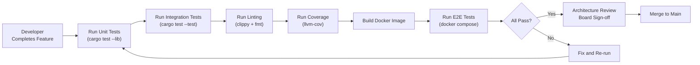

# MuST Replay Simulator Service — Acceptance Criteria

| Field              | Value                                    |
|--------------------|------------------------------------------|
| **Document ID**    | MUST-SIM-ACC-008                         |
| **Version**        | 1.0.0-DRAFT                             |
| **Date**           | 2026-07-03                               |
| **Status**         | DRAFT — PENDING REVIEW                   |

---

## 1. Purpose

This document defines the acceptance criteria that must be satisfied before the Replay Simulator Service is approved for integration into the MuST pipeline. Each criterion is traceable to requirements in the SRS (01_SRS.md) and verified by test cases in the Test Plan (07_TestPlan.md).

**Acceptance authority:** MuST Architecture Review Board.

**Acceptance method:** Each criterion is demonstrated via automated test execution or documented manual verification.

---

## 2. Functional Acceptance Criteria

### AC-001: File Ingestion

| # | Criterion | Verification | Traces To |
|---|-----------|-------------|-----------|
| 1 | The service loads a valid binary telemetry file and transitions to READY state. | TC-ING-001 | FR-010 |
| 2 | The service loads a valid CCSDS packet file and transitions to READY state. | TC-ING-002 | FR-011 |
| 3 | The service reports correct file metadata (size, estimated packet count, estimated duration) after loading. | TC-ING-006 | FR-014 |
| 4 | The service rejects a non-existent file path with FILE_NOT_FOUND error and remains in current state. | TC-ING-003 | FR-070 |
| 5 | The service rejects a file with corrupted headers with INVALID_FILE error. | TC-ING-004 | FR-013 |
| 6 | The service rejects path traversal attempts (paths containing ".."). | TC-ING-005 | NFR-050 |

### AC-002: Large File Handling

| # | Criterion | Verification | Traces To |
|---|-----------|-------------|-----------|
| 1 | The service loads a 1 GB file with RSS remaining below 512 MB. | TC-ING-007 | FR-012, NFR-020 |
| 2 | The service loads a 10 GB file in under 2 seconds. | TC-PRF-003 | NFR-012 |
| 3 | The service replays a 1 GB file to completion without memory growth beyond initial allocation + 10%. | TC-PRF-005 | NFR-020 |

### AC-003: Playback Control

| # | Criterion | Verification | Traces To |
|---|-----------|-------------|-----------|
| 1 | All 10 commands (START, STOP, PAUSE, RESUME, SEEK, LOOP, SET_SPEED, LOAD_FILE, UNLOAD_FILE, GET_STATUS) are functional. | TC-CTL-001 through TC-CTL-007 | FR-020 |
| 2 | Every valid state transition in the transition table (05_StateMachine.md) succeeds. | TC-STM-001 through TC-STM-011 | FR-021 |
| 3 | Every invalid state-command combination is rejected with INVALID_STATE error and causes no state change. | TC-STM-012 | FR-021 |
| 4 | All 6 speed values (1x, 2x, 4x, 8x, 16x, 32x) are accepted and correctly applied. | TC-CTL-001 | FR-022 |
| 5 | Step mode (speed=0) delivers exactly one packet per step command. | TC-CTL-003 | FR-023 |
| 6 | Seek repositions to the correct packet (verified by next published packet timestamp). | TC-CTL-004, TC-PUB-005 | FR-024 |
| 7 | Loop mode restarts replay from beginning upon EOF. | TC-CTL-006, TC-PUB-006 | FR-025 |
| 8 | Frame counter and packet counter increment monotonically across the session. | TC-PUB-003 | FR-027, FR-028 |
| 9 | Progress percentage, elapsed time, and remaining time are reported via GET /status. | TC-RAP-006 | FR-028 |

### AC-004: Timing Fidelity

| # | Criterion | Verification | Traces To |
|---|-----------|-------------|-----------|
| 1 | At 1x speed, inter-packet timing jitter P99 is below 1 ms over 10,000 packets. | TC-PRF-001 | NFR-010 |
| 2 | At each speed (2x, 4x, 8x, 16x, 32x), delays are correctly scaled by 1/speed. | TC-TIM-002 through TC-TIM-004 | FR-031 |
| 3 | Drift correction prevents cumulative error from exceeding 10 ms over 1 hour at 1x. | TC-PRF-007 | FR-033 |
| 4 | Pause freezes the replay clock: no packets are published during pause. | TC-TIM-008, TC-PUB-004 | FR-034 |
| 5 | Resume continues from the exact paused position with correct remaining delay. | TC-TIM-009, TC-PUB-004 | FR-034 |
| 6 | Seek resets the timing engine: no drift carryover from pre-seek state. | TC-TIM-010 | FR-035 |
| 7 | Monotonic clock is used (verified by code review: no usage of `SystemTime::now()`). | Code review | FR-032 |

### AC-005: Source Abstraction

| # | Criterion | Verification | Traces To |
|---|-----------|-------------|-----------|
| 1 | The `SourcePort` trait is defined with: open, read_next_packet, seek, close, metadata. | Code review | FR-041 |
| 2 | The replay engine (domain + application layers) contains zero imports from adapter modules. | Code review, `grep` verification | FR-042 |
| 3 | A mock `SourcePort` implementation can be substituted in tests without modifying any domain code. | TC-ABS-001 | FR-042 |
| 4 | `FileReaderAdapter` implements `SourcePort` for both binary and CCSDS formats. | TC-ABS-002, TC-ABS-003 | FR-043 |

### AC-006: Publishing

| # | Criterion | Verification | Traces To |
|---|-----------|-------------|-----------|
| 1 | Every replayed packet is wrapped in a `TelemetryEnvelope` with all required fields. | TC-PUB-002 | FR-051 |
| 2 | The gRPC `StreamTelemetry` RPC delivers packets in order to a connected client. | TC-GAP-001 | FR-050 |
| 3 | Packets published during a session have strictly increasing sequence numbers. | TC-PUB-003 | FR-027 |

### AC-007: API

| # | Criterion | Verification | Traces To |
|---|-----------|-------------|-----------|
| 1 | All 10 REST endpoints are functional and return correct HTTP status codes. | TC-RAP-001 through TC-RAP-009 | FR-060, FR-063 |
| 2 | All gRPC RPCs are functional and return correct gRPC status codes. | TC-GAP-001 through TC-GAP-004 | FR-061 |
| 3 | REST and gRPC return identical error codes for identical invalid commands. | Parity test | FR-062 |
| 4 | Health endpoints (/health/live, /health/ready, /health/startup) all respond correctly. | TC-RAP-008, TC-RAP-009 | NFR-042 |

### AC-008: Error Handling

| # | Criterion | Verification | Traces To |
|---|-----------|-------------|-----------|
| 1 | A corrupted packet mid-file is skipped, logged, and replay continues. | TC-ERR-002 | FR-072 |
| 2 | Non-monotonic timestamps are handled with a fallback (previous_ts + min_delta). | TC-ERR-003 | FR-072 |
| 3 | Unrecoverable errors transition to ERROR state with a diagnostic event. | TC-ERR-001, TC-ERR-006 | FR-070 |
| 4 | Invalid command sequences return error responses without changing state. | TC-ERR-005 | FR-021 |
| 5 | Every error produces a structured log entry with error code, context, and recovery action. | Log inspection | FR-073 |

---

## 3. Non-Functional Acceptance Criteria

### AC-009: Performance

| # | Criterion | Verification | Target | Traces To |
|---|-----------|-------------|--------|-----------|
| 1 | Sustained throughput at 32x exceeds 100,000 packets/second. | TC-PRF-002 | > 100K pkt/s | NFR-011 |
| 2 | Command response latency (API → state change) is below 50 ms. | TC-PRF-004 | < 50 ms | NFR-013 |
| 3 | CPU utilization at 1x is below 5% of a single core. | TC-PRF-006 | < 5% | NFR-022 |
| 4 | 24-hour continuous replay shows no memory growth and drift < 10 ms. | TC-PRF-007 | Stable | NFR-032 |

### AC-010: Observability

| # | Criterion | Verification | Traces To |
|---|-----------|-------------|-----------|
| 1 | Prometheus metrics endpoint responds at /metrics with all defined metrics. | Manual | NFR-040 |
| 2 | Logs are structured JSON containing timestamp, level, target, message, fields. | Log inspection | NFR-041 |
| 3 | State transitions are logged at INFO level with from/to states and triggering command. | Log inspection | NFR-041 |

### AC-011: Deployment

| # | Criterion | Verification | Traces To |
|---|-----------|-------------|-----------|
| 1 | Docker image builds successfully with multi-stage Dockerfile. | CI build | NFR-060 |
| 2 | Container starts and passes health checks within 30 seconds. | Docker healthcheck | NFR-042 |
| 3 | Service is configurable via YAML file and environment variable overrides. | Manual | CON-005 |
| 4 | Container runs as non-root user. | `docker exec whoami` | NFR-050 |

### AC-012: Code Quality

| # | Criterion | Verification | Target |
|---|-----------|-------------|--------|
| 1 | `cargo clippy -- -D warnings` produces zero warnings. | CI | 0 warnings |
| 2 | `cargo fmt -- --check` produces zero diffs. | CI | 0 diffs |
| 3 | `cargo audit` reports zero known vulnerabilities. | CI | 0 vulns |
| 4 | Test coverage (line) meets or exceeds 80%. | `cargo llvm-cov` | >= 80% |
| 5 | Domain modules (`domain/`, `ports/`) contain zero I/O framework imports. | `grep` verification | 0 matches |

---

## 4. Acceptance Workflow

---

## 5. Sign-off Record

| Criterion | Reviewer | Date | Status |
|-----------|----------|------|--------|
| AC-001 | — | — | PENDING |
| AC-002 | — | — | PENDING |
| AC-003 | — | — | PENDING |
| AC-004 | — | — | PENDING |
| AC-005 | — | — | PENDING |
| AC-006 | — | — | PENDING |
| AC-007 | — | — | PENDING |
| AC-008 | — | — | PENDING |
| AC-009 | — | — | PENDING |
| AC-010 | — | — | PENDING |
| AC-011 | — | — | PENDING |
| AC-012 | — | — | PENDING |

---

## 6. Revision History

| Version | Date       | Description    |
|---------|------------|----------------|
| 1.0.0   | 2026-07-03 | Initial draft  |
