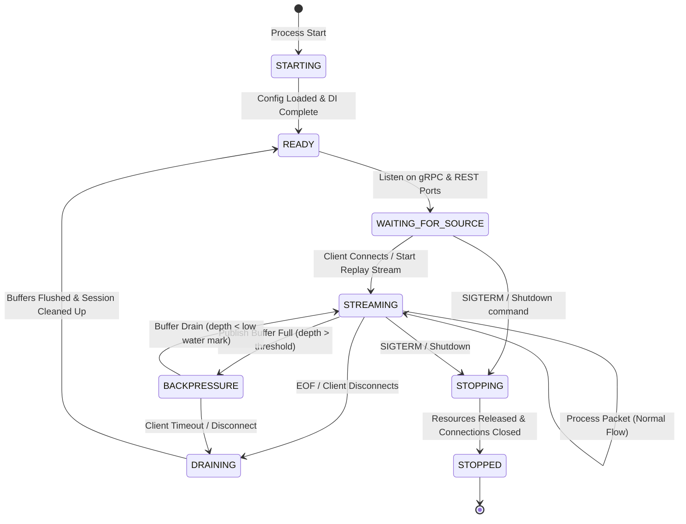

# Telemetry Gateway — State Machine Specification

This document details the lifecycle and state machine of the **Telemetry Gateway** service. Every production instance of the service executes transitions matching this state diagram.

---

## 1. State Transition Diagram

---

## 2. State Definitions

| State | Description | Inbound gRPC Behavior | Outbound RabbitMQ Behavior |
|-------|-------------|-----------------------|----------------------------|
| **STARTING** | Service is booting, reading configuration files, parsing environment variables, and configuring DI containers. | Connection Refused (port closed) | Connecting |
| **READY** | Service is fully initialized and idle. | Listening (handshake ready) | Connected |
| **WAITING_FOR_SOURCE** | Listeners are active, waiting for the first active ingestion stream from a registered source. | Accepting Connections | Connected |
| **STREAMING** | Active data transmission. Receiving packets from gRPC, running validation, normalization, enrichment, routing, and publishing. | Accept Stream & Process | Publish & Confirm active |
| **BACKPRESSURE** | Outbound buffer (mpsc) depth exceeded. The gateway actively rejects packets to push backpressure upstream. | Reject Packets (RESOURCE_EXHAUSTED) | Processing backlog |
| **DRAINING** | Stream EOF or disconnect received. Processing remaining items stored in the internal bounded queue. | Reject new streams | Flush remaining packets |
| **STOPPING** | Service shutdown initiated. Releasing memory, shutting down servers, flushing remaining logs. | Reject new connections | Close channels & connections |
| **STOPPED** | All resources released. Process exits. | Dead | Dead |

---

## 3. Transition Rules & Actions

### 1. STARTING ──> READY
* **Trigger**: Main function successfully registers adapters, loads configuration, and finishes dependency injection.
* **Action**: Start REST router.

### 4. STREAMING ──> BACKPRESSURE
* **Trigger**: Publish channel queue length exceeds `HIGH_WATER_MARK` (e.g., 90% of capacity).
* **Action**: Set state to `BACKPRESSURE`, reject new gRPC packets with `RESOURCE_EXHAUSTED` status.

### 5. BACKPRESSURE ──> STREAMING
* **Trigger**: Publish channel queue length falls below `LOW_WATER_MARK` (e.g., 30% of capacity).
* **Action**: Set state to `STREAMING`, resume processing gRPC incoming stream.

### 6. STREAMING / BACKPRESSURE ──> DRAINING
* **Trigger**: gRPC stream closes (EOF) or client disconnects.
* **Action**: Stop pulling from stream; wait for the worker channel to empty.

### 7. DRAINING ──> READY
* **Trigger**: Worker and publisher channels are fully empty.
* **Action**: Clean up session entry in memory, emit `SessionCompleted` event, return to `READY` state.

### 8. Any State ──> STOPPING
* **Trigger**: System signals `SIGINT`/`SIGTERM` or admin `POST /api/v1/gateway/stop` REST call.
* **Action**: Stop gRPC listeners, flush buffers with a timeout (e.g. 5 seconds), close RabbitMQ connections.
