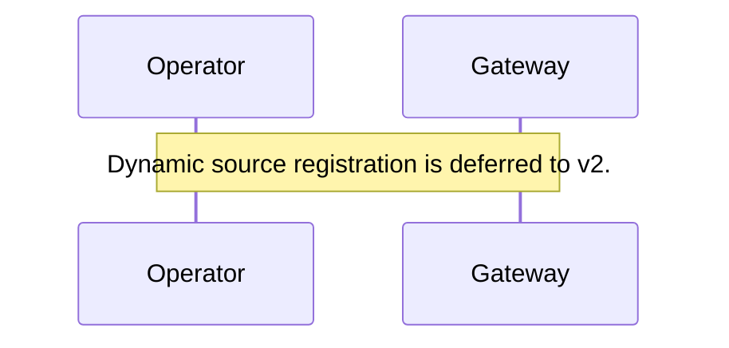
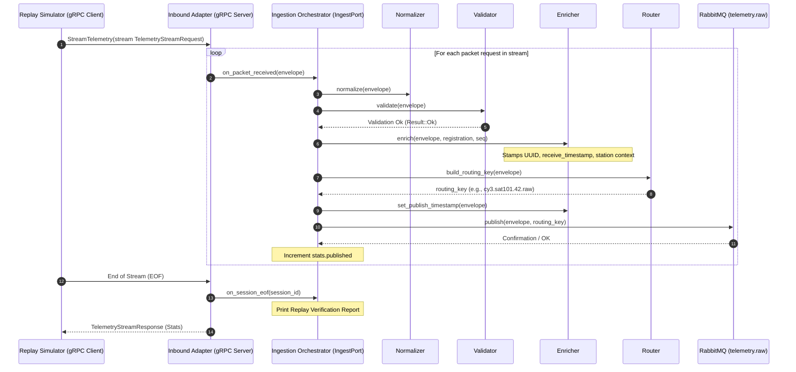
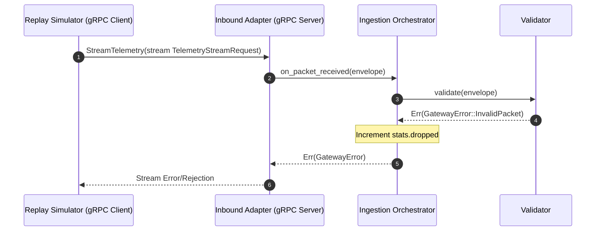
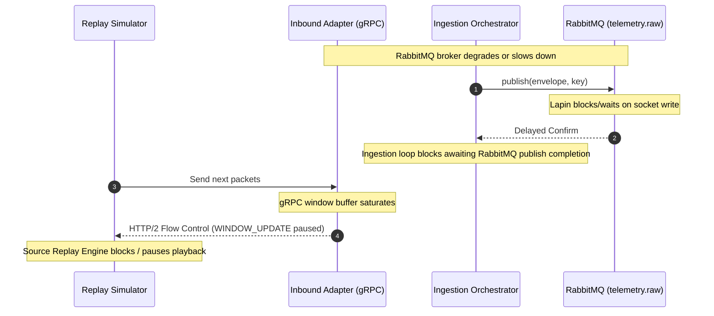
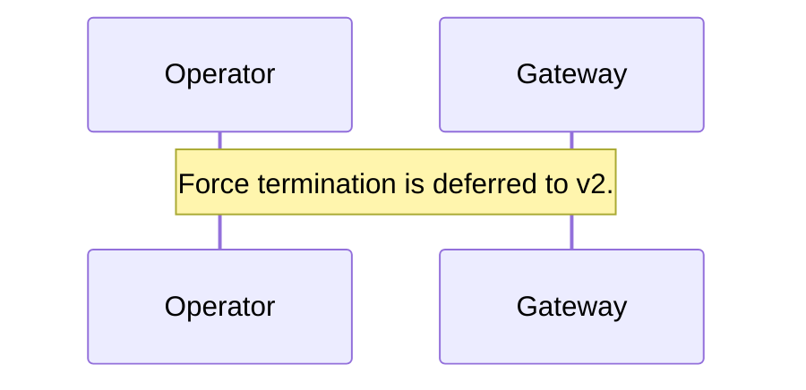

# MuST Telemetry Gateway — Sequence Diagrams

| Field              | Value                                    |
|--------------------|------------------------------------------|
| **Document ID**    | MUST-GW-SEQ-004                          |
| **Version**        | 1.0.0-DRAFT                             |
| **Date**           | 2026-07-03                               |
| **Status**         | DRAFT — PENDING REVIEW                   |

---

## 1. Source Registration Flow (DEFERRED)

> [!NOTE]
> In Version 1, dynamic registration is deferred. The gateway uses static configuration profiles (mocked in `IngestionOrchestrator::mock_registration`) to assign mission context, satellite identifiers, and ground station contexts.

---

## 2. Telemetry Ingestion and Processing Flow

---

## 3. Validation Failure and Rejection Flow

---

## 4. Backpressure and Saturated Buffer Flow

When the RabbitMQ broker experiences connection lag or high network load, Lapin block/wait mechanisms propagate backpressure through the application task loop back to the Tonic streaming stream consumer, forcing the gRPC client to pause.

---

## 5. Force-Termination Flow (DEFERRED)

> [!NOTE]
> Operator-initiated dynamic termination is deferred. In Version 1, the session naturally stops when the gRPC client terminates the connection or sends an EOF.

