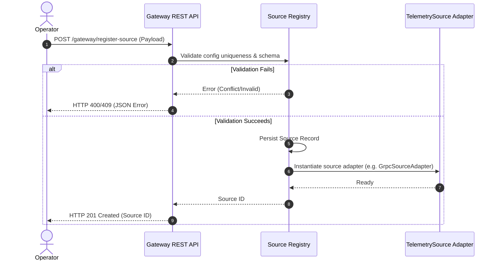
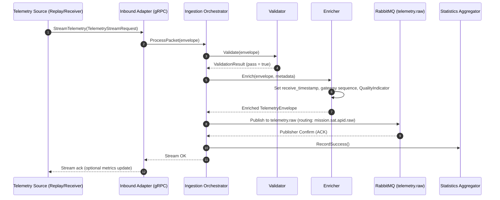
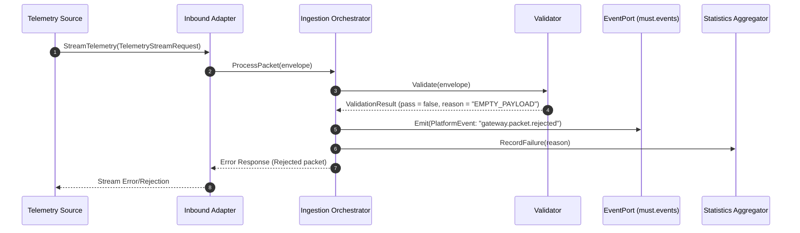
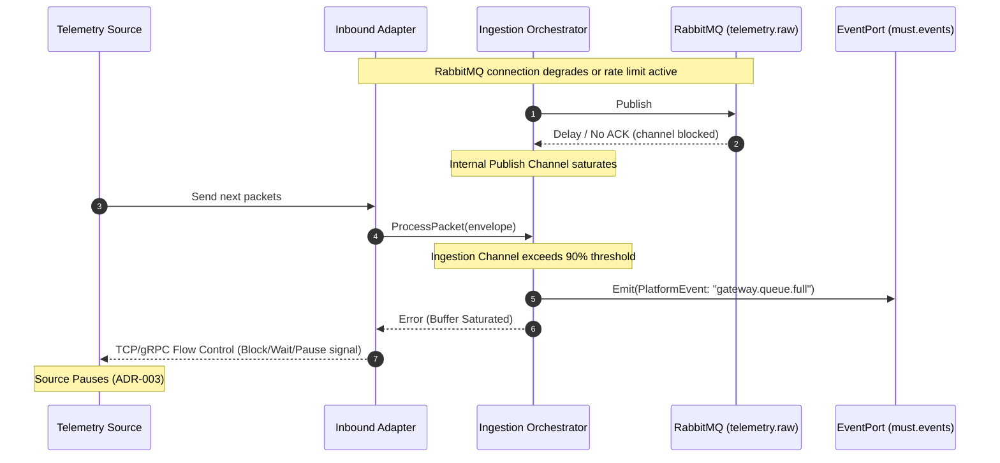
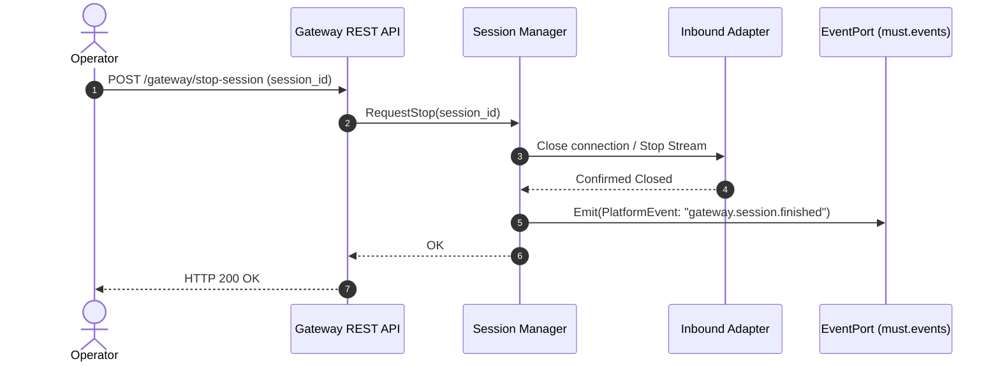

# MuST Telemetry Gateway — Sequence Diagrams

| Field              | Value                                    |
|--------------------|------------------------------------------|
| **Document ID**    | MUST-GW-SEQ-004                          |
| **Version**        | 1.0.0-DRAFT                             |
| **Date**           | 2026-07-03                               |
| **Status**         | DRAFT — PENDING REVIEW                   |

---

## 1. Source Registration Flow

---

## 2. Telemetry Ingestion and Processing Flow

---

## 3. Validation Failure and Rejection Flow

---

## 4. Backpressure and Saturated Buffer Flow

When the RabbitMQ client experiences connection lag or high network load, the internal Go channel buffers begin to fill. This triggers backpressure to preserve stability.

---

## 5. Force-Termination Flow

