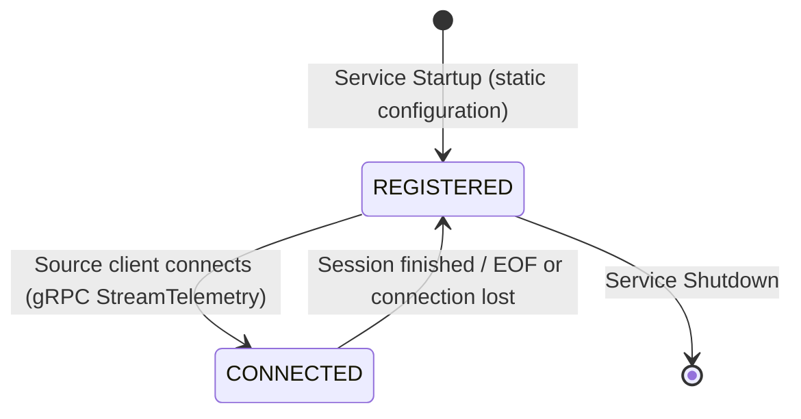
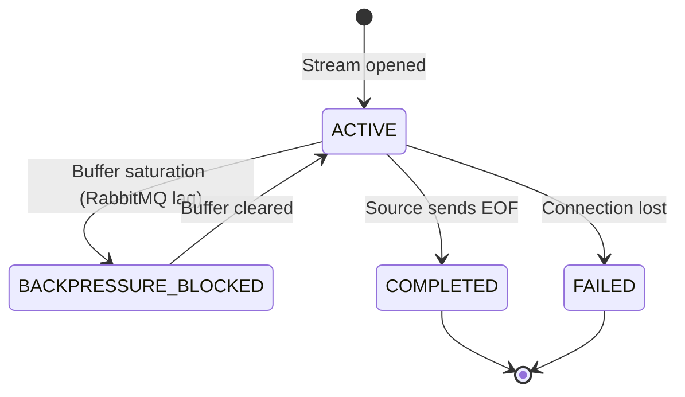
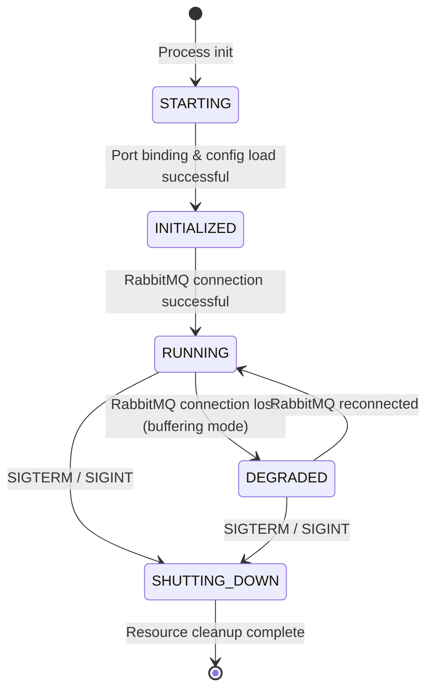

# MuST Telemetry Gateway — State Machines

| Field              | Value                                    |
|--------------------|------------------------------------------|
| **Document ID**    | MUST-GW-STATE-005                        |
| **Version**        | 1.0.0-DRAFT                             |
| **Date**           | 2026-07-03                               |
| **Status**         | DRAFT — PENDING REVIEW                   |

---

## 1. Source Lifecycle State Machine

A telemetry source object tracks connectivity and operational registry status. In Version 1, registration is static and loaded at startup.

### Transition Table

| Current State | Event | Target State | Action / Side Effect |
|---------------|-------|--------------|----------------------|
| `[*]` | Service Startup | `REGISTERED` | Load static configs from environment / file |
| `REGISTERED` | Client Connect | `CONNECTED` | Open gRPC stream, start ingestion session |
| `CONNECTED` | Session Finished (EOF) / Disconnect | `REGISTERED` | Print session report, close stream |
| `REGISTERED` | Service Shutdown | `[*]` | Cleanup resources |

---

## 2. Telemetry Session State Machine

A session encapsulates a single, continuous stream of telemetry from a connected source.

### Transition Table

| Current State | Event | Target State | Action / Side Effect |
|---------------|-------|--------------|----------------------|
| `[*]` | Stream Opened | `ACTIVE` | Initialize session stats, reset silence timers |
| `ACTIVE` | Socket Write Blocked | `BACKPRESSURE_BLOCKED` | Block ingestion loop, triggering downstream TCP/HTTP2 flow control |
| `BACKPRESSURE_BLOCKED` | Socket Writable | `ACTIVE` | Resume publishing |
| `ACTIVE` | EOF message received | `COMPLETED` | Finalize statistics, print verification report |
| `ACTIVE` | Stream disconnected abruptly | `FAILED` | Mark session failed, print verification report |

---

## 3. Gateway Service State Machine

Represents the global system state of the service instance.

### Invariants
- **Telemetry Ingestion Invariant**: In the `DEGRADED` state, telemetry continues to be accepted and written to stdout (Console Sink fallback) to prevent packet loss.
- **System Memory Invariant**: Under no circumstance shall the gateway grow its buffers beyond memory safety boundaries. All operations rely on small, fixed-size heap structures.
