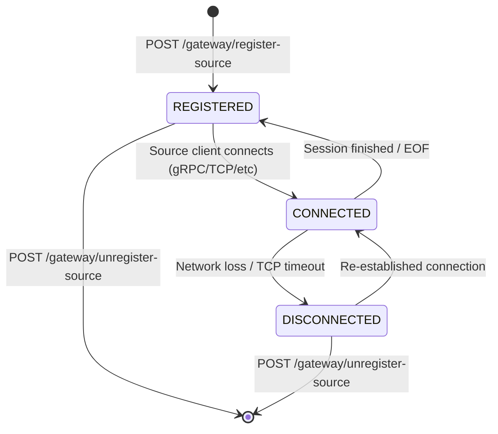
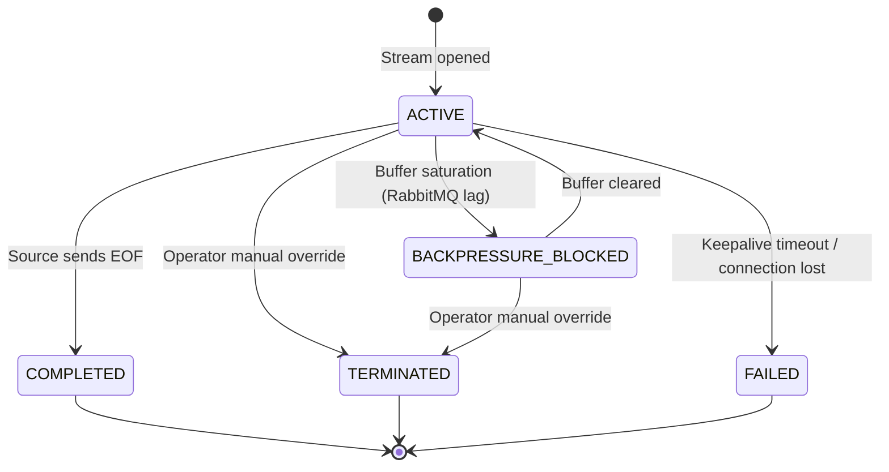
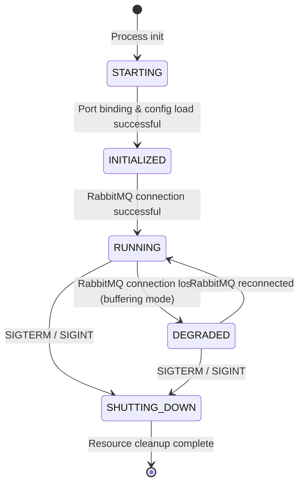

# MuST Telemetry Gateway — State Machines

| Field              | Value                                    |
|--------------------|------------------------------------------|
| **Document ID**    | MUST-GW-STATE-005                        |
| **Version**        | 1.0.0-DRAFT                             |
| **Date**           | 2026-07-03                               |
| **Status**         | DRAFT — PENDING REVIEW                   |

---

## 1. Source Lifecycle State Machine

A telemetry source object tracks connectivity and operational registry status.

### Transition Table

| Current State | Event | Target State | Action / Side Effect |
|---------------|-------|--------------|----------------------|
| `[*]` | RegisterSource | `REGISTERED` | Persist config, initialize adapter |
| `REGISTERED` | Client Connect | `CONNECTED` | Open gRPC stream, start session |
| `CONNECTED` | Network Timeout / Connection Lost | `DISCONNECTED` | Emit `gateway.source.disconnected`, pause stream context |
| `DISCONNECTED` | Client Reconnect | `CONNECTED` | Re-attach stream context, resume ingestion |
| `CONNECTED` | Session Finished (EOF) | `REGISTERED` | Close stream, cleanup resources |
| `REGISTERED` | UnregisterSource | `[*]` | Remove config, tear down adapter resources |

---

## 2. Telemetry Session State Machine

A session encapsulates a single, continuous stream of telemetry from a connected source.

### Transition Table

| Current State | Event | Target State | Action / Side Effect |
|---------------|-------|--------------|----------------------|
| `[*]` | Stream Opened | `ACTIVE` | Assign Session ID, emit `gateway.session.started` |
| `ACTIVE` | Buffer Depth > 90% | `BACKPRESSURE_BLOCKED` | Emit `gateway.queue.full`, block or pause ingestion thread |
| `BACKPRESSURE_BLOCKED` | Buffer Depth < 50% | `ACTIVE` | Resume ingestion, allow incoming streams |
| `ACTIVE` | EOF message received | `COMPLETED` | Finalize statistics, emit `gateway.session.finished` |
| `ACTIVE` / `BACKPRESSURE_BLOCKED` | Stop Session API | `TERMINATED` | Force disconnect socket, emit `gateway.session.finished` |
| `ACTIVE` | Stream disconnected abruptly | `FAILED` | Mark session failed, release active locks, emit error |

---

## 3. Gateway Service State Machine

Represents the global system state of the service instance.

### Invariants
- **Telemetry Ingestion Invariant**: In the `DEGRADED` state, telemetry continues to be accepted and placed in the memory/disk ring buffer *until* buffer capacity is exceeded. Once exceeded, new incoming packets MUST be rejected with `ERR_BUS_DISCONNECTED`.
- **System Memory Invariant**: Under no circumstance shall the gateway grow its buffers beyond the memory limits defined in the YAML configuration (defaults to 1.5 GB).
