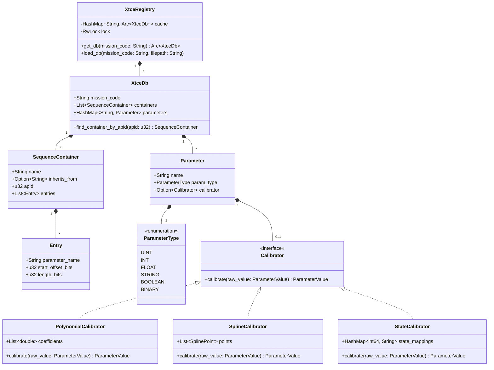
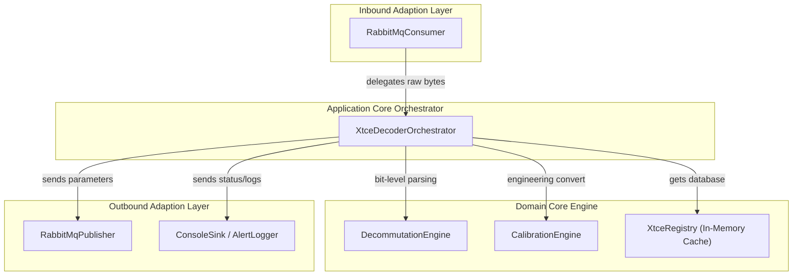
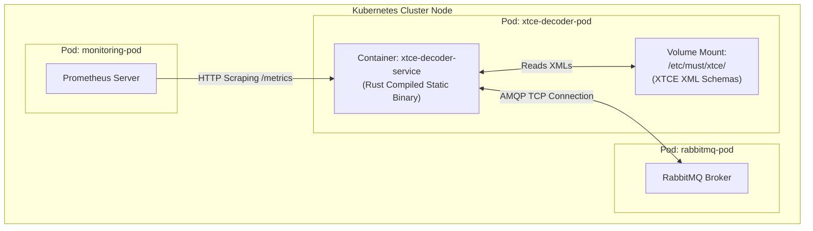

# XTCE Decoder Service — Architecture and Design Document

| Field              | Value                                    |
|--------------------|------------------------------------------|
| **Document ID**    | MUST-XTCE-ARCH-002                       |
| **Version**        | 1.0.0                                    |
| **Date**           | 2026-07-10                               |
| **Status**         | PROPOSED                                 |

---

## 1. High-Level Architecture

The XTCE Decoder is an event-driven, enriching microservice structured using the **Hexagonal Architecture (Ports and Adapters)** pattern. This separates the pure business domain (XTCE schema parsing, bit decommutation, and telemetry calibration) from infrastructure dependencies like RabbitMQ, the file system, and Protobuf serialization.

### 1.1 Context Diagram
```
           Ingress Bus                       Egress Bus
        ┌──────────────┐                  ┌──────────────┐
        │  RabbitMQ    │                  │  RabbitMQ    │
        │  telemetry   │                  │  telemetry   │
        │ .identified  │                  │ .engineering │
        └──────┬───────┘                  └──────▲───────┘
               │                                 │
               │ [consume]                       │ [publish]
        ┌──────▼─────────────────────────────────┴──────┐
        │                                               │
        │              XTCE DECODER SERVICE             │
        │                                               │
        └───────────────────────────────────────────────┘
```

---

## 2. Hexagonal Architecture

The architecture separates concerns into concentric rings: the core Domain, Application Orchestration, Ports, and concrete Adapters.

```
┌─────────────────────────────────────────────────────────────────────┐
│                    DRIVING ADAPTERS (Inbound)                       │
│  ┌──────────────────────────────────────────────────────────────┐  │
│  │ RabbitMqConsumer (lapin)                                     │  │
│  │ (Listens on queue, binds to routing key "#.identified")      │  │
│  └───────────────────────┬──────────────────────────────────────┘  │
│                          │                                          │
│                          ▼                                          │
│                  ┌───────────────┐                                  │
│                  │    PORTS      │ (EnvelopeConsumer, DeliveryAcker)│
│                  └───────┬───────┘                                  │
├──────────────────────────┼──────────────────────────────────────────┤
│                     APPLICATION CORE                                 │
│  ┌───────────────────────▼────────────────────────────────────────┐  │
│  │               XtceDecoderOrchestrator                          │  │
│  │                                                                │  │
│  │  ┌────────────────────┐   ┌─────────────────┐                  │  │
│  │  │ DecommutationEngine│   │ CalibrationEngine│                  │  │
│  │  └────────────────────┘   └─────────────────┘                  │  │
│  │  ┌────────────────────┐                                        │  │
│  │  │ XtceRegistry (Core)│                                        │  │
│  │  └────────────────────┘                                        │  │
│  └───────────────────────┬────────────────────────────────────────┘  │
│                          │                                          │
│                  ┌───────▼───────┐                                  │
│                  │    PORTS      │ (EngineeringPublisher, AlertPort)│
│                  └───────┬───────┘                                  │
├──────────────────────────┼──────────────────────────────────────────┤
│                    DRIVEN ADAPTERS (Outbound)                        │
│  ┌───────────────────────────────┬──────────────────────────────┐  │
│  │ RabbitMqPublisher (lapin)     │ ConsoleSink / AlertLogger    │  │
│  │ (Publishes to 'engineering'    │ (Logs packets and anomalies) │  │
│  │  exchange)                    │                              │  │
│  └───────────────────────────────┴──────────────────────────────┘  │
└─────────────────────────────────────────────────────────────────────┘
```

### 2.1 Module Responsibilities

#### 2.1.1 Inbound Ports & Adapters
- `EnvelopeConsumer`: Port trait defining the start of the async consuming pipeline.
- `RabbitMqConsumer`: Inbound adapter implementing `EnvelopeConsumer` using `lapin` to consume raw bytes from the `telemetry.identified` queue.
- `DeliveryAcker`: Inbound port wrapping message acknowledgement controls (`ack`, `nack`).

#### 2.1.2 Application Core
- `XtceDecoderOrchestrator`: Orchestrator of the decommutation use case. It deserializes envelopes, queries the `XtceRegistry` to fetch the cached `XtceDb`, triggers bit decommutation via `DecommutationEngine`, executes calibration via `CalibrationEngine`, appends parameters, and delegates publishing.

#### 2.1.3 Domain Logic
- `XtceRegistry`: Caches parsed XML configurations per mission.
- `DecommutationEngine`: Core parser that walks through the bit array, resolving variables and offsets dynamically.
- `CalibrationEngine`: Math evaluator applying calibration algorithms.
- `XtceDb`: In-memory Representation of the loaded XTCE file.

#### 2.1.4 Outbound Ports & Adapters
- `EngineeringPublisher`: Outbound port for sending enriched telemetry envelopes to downstream exchanges.
- `RabbitMqPublisher`: Driven adapter implementing `EngineeringPublisher` via `lapin` with publisher confirmations enabled.
- `AlertPort`: Outbound port for system warnings, telemetry validation errors, or missing mission files.
- `ConsoleSink`: Driven adapter for stdout tracing.

---

## 3. Folder Structure

The layout adheres to standard Rust cargo project configuration and follows the patterns of other MuST services:

```
xtce-decoder/
├── Cargo.toml                  # Project dependencies (lapin, prost, tokio, roxmltree)
├── build.rs                    # Tonic/prost proto compilation script
├── src/
│   ├── main.rs                 # Composition root (entrypoint)
│   ├── config.rs               # Environmental configuration loader (AppConfig)
│   ├── domain/                 # Core domain logic (framework-free)
│   │   ├── mod.rs
│   │   ├── registry.rs         # XtceRegistry, thread-safe cache
│   │   ├── decommutation.rs    # Bit-level unpacking
│   │   ├── calibration.rs      # Polynomial, Spline, Enum calibrators
│   │   ├── models.rs           # XtceDb, Parameter, Container domain models
│   │   └── errors.rs           # Domain-specific errors
│   ├── application/            # Coordinates domain use-cases
│   │   ├── mod.rs
│   │   └── orchestrator.rs     # XtceDecoderOrchestrator implementation
│   ├── ports/                  # Interface boundaries (inbound/outbound)
│   │   ├── mod.rs
│   │   ├── inbound.rs          # EnvelopeConsumer, DeliveryAcker ports
│   │   └── outbound.rs         # EngineeringPublisher, AlertPort ports
│   ├── adapters/               # Port implementations (lapin, console)
│   │   ├── mod.rs
│   │   ├── inbound/
│   │   │   ├── mod.rs
│   │   │   └── rabbitmq_consumer.rs # Lapin consumer
│   │   └── outbound/
│   │       ├── mod.rs
│   │       ├── rabbitmq_publisher.rs # Lapin publisher
│   │       └── console_sink.rs       # Console logger
│   └── proto.rs                # Rust compiled code for protobufs
└── docs/                       # Specifications and diagrams
```

---

## 4. Domain Model

The domain logic is organized around the XTCE XML configuration.



---

## 5. Ports & Adapters Interfaces

To enforce the hexagonal boundary, ports are defined as asynchronous Rust traits.

```rust
// File: src/ports/inbound.rs
use async_trait::async_trait;
use futures::future::BoxFuture;

#[async_trait]
pub trait EnvelopeConsumer: Send + Sync {
    /// Starts the asynchronous consume loop. Takes a callback handler closure.
    async fn start(&self, handler: Arc<dyn Fn(Vec<u8>, String, Arc<dyn DeliveryAcker + Send + Sync>) -> BoxFuture<'static, ()> + Send + Sync>) -> Result<(), crate::domain::errors::DomainError>;
}

#[async_trait]
pub trait DeliveryAcker: Send + Sync {
    async fn ack(&self);
    async fn nack(&self);
}
```

```rust
// File: src/ports/outbound.rs
use async_trait::async_trait;
use crate::proto::must::telemetry::v1::TelemetryEnvelope;

#[async_trait]
pub trait EngineeringPublisher: Send + Sync {
    /// Publishes the enriched telemetry envelope to RabbitMQ
    async fn publish(&self, envelope: &TelemetryEnvelope, routing_key: &str) -> Result<(), crate::domain::errors::DomainError>;
}

#[async_trait]
pub trait AlertPort: Send + Sync {
    /// Emits non-blocking warnings or alert logs
    async fn emit_warning(&self, context: &str, message: &str);
    async fn emit_critical(&self, context: &str, message: &str);
}
```

---

## 6. XTCE Database Integration Strategy

### 6.1 Configuration-Based Discovery
XTCE XML database files are stored locally in a directory specified by `XTCE_DB_DIR` (e.g. `/etc/must/xtce/`).
The file naming convention uses the mission code:
`{mission_code}.xml` (e.g. `cy3.xml`).

### 6.2 Caching Strategy
- Parsed XML databases are converted into an optimized domain structure (`XtceDb`) and held in an `Arc<RwLock<HashMap<String, Arc<XtceDb>>>>` cache.
- When an envelope is received, the orchestrator performs a read-lock lookup.
- If a cache miss occurs, the orchestrator obtains a write-lock, reads the XML file from disk, parses and compiles it, updates the cache, and releases the write-lock.
- A cache miss on an invalid mission code will register a negative cache entry or fail-fast to prevent repeatedly checking the file system for non-existent missions.

### 6.3 Schema Validation
At load time, the service utilizes a lightweight XML parsing library (`roxmltree` or `quick-xml`) to validate the document structure. Key constraints verified immediately:
1. XML must be well-formed.
2. Root element must be `SpaceSystem`.
3. All container inheritance paths (`inherits_from`) must resolve without cycles.
4. Parameter references must point to valid parameter declarations in the `ParameterSet`.

---

## 7. Component Diagram



---

## 8. Deployment Diagram


