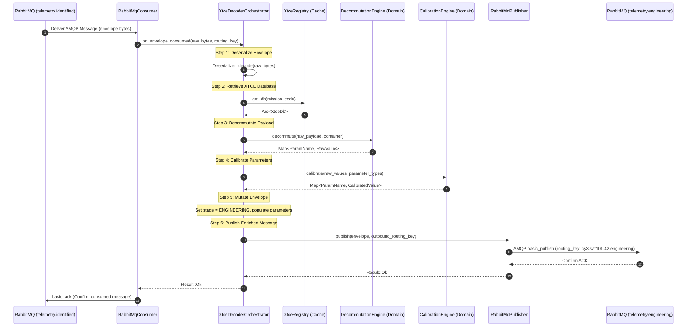
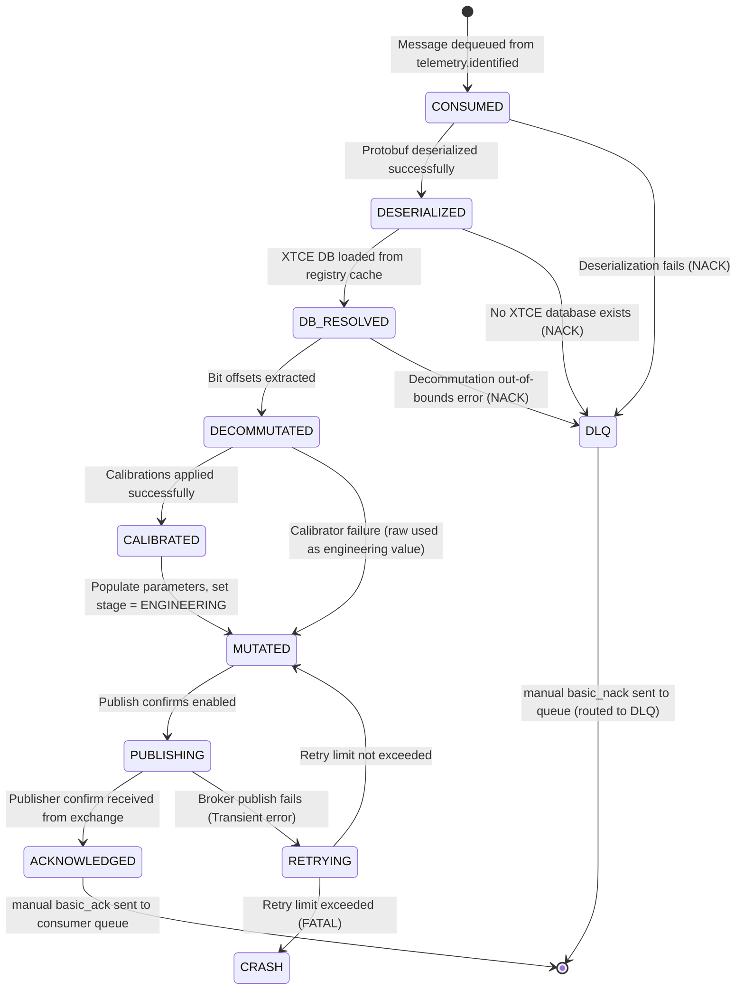

# XTCE Decoder Service — Contracts and Data Flow

| Field              | Value                                    |
|--------------------|------------------------------------------|
| **Document ID**    | MUST-XTCE-CON-003                        |
| **Version**        | 1.0.0                                    |
| **Date**           | 2026-07-10                               |
| **Status**         | PROPOSED                                 |

---

## 1. Protobuf Contract Updates

To support parameterized telemetry payload enrichment, the shared Protobuf definitions in `shared/proto/must/telemetry/v1/envelope.proto` must be updated.

### 1.1 Protobuf Changes
We introduce a nested `TelemetryParameter` structure and update the parent `TelemetryEnvelope` with a repeated parameters field.

```diff
// File: shared/proto/must/telemetry/v1/envelope.proto

syntax = "proto3";
package must.telemetry.v1;

import "must/common/v1/identifiers.proto";
import "must/common/v1/timestamps.proto";
import "must/telemetry/v1/packet.proto";
import "must/telemetry/v1/ccsds.proto";

message TelemetryEnvelope {
  string envelope_id = 1;
  uint64 sequence_number = 2;
  must.common.v1.SourceIdentifier source = 3;
  must.common.v1.GroundStationIdentifier station = 4;
  must.common.v1.MissionIdentifier mission = 5;
  must.common.v1.SatelliteIdentifier satellite = 6;
  must.common.v1.MustTimestamp original_timestamp = 7;
  must.common.v1.MustTimestamp receive_timestamp = 8;
  must.common.v1.MustTimestamp publish_timestamp = 9;
  RawTelemetryPacket raw_packet = 10;
  CcsdsPacketHeader ccsds_header = 11;
  CcsdsSecondaryHeader ccsds_secondary = 12;
  uint32 apid = 13;
  uint32 vcid = 14;
  ProcessingStage stage = 15;
  map<string, string> annotations = 16;
  QualityIndicator quality = 17;
+
+  // Enriched engineering parameters from XTCE decommutation
+  repeated TelemetryParameter parameters = 18;
}

+message TelemetryParameter {
+  string name = 1;                           // Fully qualified parameter path, e.g. "/Spacecraft/EPS/BatteryVoltage"
+  ParameterValue raw_value = 2;             // Decommuted raw value
+  ParameterValue engineering_value = 3;     // Calibrated engineering value
+  ParameterValidity validity = 4;           // Integrity status of the parameter extraction
+}
+
+message ParameterValue {
+  oneof value {
+    int64 int_value = 1;
+    double float_value = 2;
+    string string_value = 3;
+    bool bool_value = 4;
+    bytes bytes_value = 5;
+  }
+}
+
+enum ParameterValidity {
+  PARAMETER_VALIDITY_UNSPECIFIED = 0;
+  PARAMETER_VALIDITY_VALID = 1;
+  PARAMETER_VALIDITY_INVALID = 2;
+  PARAMETER_VALIDITY_STALE = 3;
+  PARAMETER_VALIDITY_OUT_OF_LIMITS = 4;
+}
```

---

## 2. RabbitMQ Topology & Contracts

The service binds to the message bus to consume identified packets and publish parameterized telemetry.

```
                  Exchange: telemetry.identified (Topic)
                               │
                       [key: cy3.sat101.42.identified]
                               ▼
                       Queue: xtce.process
                               │
                     [XTCE Decoder Service]
                               │
                       [key: cy3.sat101.42.engineering]
                               ▼
                 Exchange: telemetry.engineering (Topic)
```

### 2.1 Input Bindings
- **Exchange**: `telemetry.identified` (topic, durable)
- **Queue**: `xtce.process` (durable, bound with DLX)
- **Routing Key Pattern**: `#.identified` (consumes all identified payloads)
- **QoS Prefetch**: `50` (optimized for concurrent CPU conversion)

### 2.2 Output Bindings
- **Exchange**: `telemetry.engineering` (topic, durable)
- **Outbound Routing Key**: `{mission_code}.{satellite_id}.{apid}.engineering`
  - *Example*: `cy3.sat101.42.engineering`

### 2.3 AMQP Message Metadata
Every published message MUST set these headers:
- `content_type`: `application/x-protobuf`
- `delivery_mode`: `2` (persistent)
- `message_id`: Matching `envelope.envelope_id` (guarantees trace correlation)
- `app_id`: `xtce-decoder-service`

---

## 3. End-to-End Packet Journey

Here is the lifecycle of a single telemetry frame starting from the simulator:

### 3.1 Step 1: Simulator to Gateway
The Replay Simulator reads a binary file containing raw frame bytes for APID 42 and streams a gRPC request.
- **Payload**: `[0x08, 0x2A, 0xC0, 0x01, 0x00, 0x0A, 0x0F, 0xFF, 0xF1, 0xA0]`
  - Byte 0-5 (CCSDS Header): APID 42 (`0x02A`), Sequence Count 1 (`0x0001`), Length 10 (`0x000A`).
  - Byte 6-9 (Application Data Payload): `[0x0F, 0xFF, 0xF1, 0xA0]`.

### 3.2 Step 2: Gateway to CCSDS Decoder
The Telemetry Gateway receives the stream, packages it, and publishes to the `telemetry.raw` exchange.
- **Routing Key**: `unk.sat0.42.raw`

### 3.3 Step 3: CCSDS Decoder to Mission ID
The CCSDS Decoder consumes the raw message, parses the header, and sets `stage = CCSDS_DECODED`.
- **Routing Key**: `unk.sat0.42.decoded`

### 3.4 Step 4: Mission ID to XTCE Decoder
The Mission ID Service consumes the decoded packet, matches rules (source and APID 42), resolving the mission to `cy3` (Chandrayaan-3) and satellite to `sat101`. It stamps the identifiers and promotes `stage = IDENTIFIED`.
- **Routing Key**: `cy3.sat101.42.identified`

### 3.5 Step 5: XTCE Decoder Decommutation & Calibration
The XTCE Decoder consumes the message and performs processing:
1. **XML Selection**: Identifies mission code `cy3` and loads `/etc/must/xtce/cy3.xml` from the in-memory cache.
2. **Container Matching**: Resolves APID 42 to the `SequenceContainer` named `PowerSubsystemContainer`.
3. **Bit-Level Extraction**:
   - **BatteryVoltage** (Offset 0 bits, length 12, unsigned int):
     - Payload bits 0-11: `0000 1111 1111` -> `0x0FF` -> `255` raw.
     - Calibrator: Polynomial $y = 0.02 \cdot x$.
     - Engineering: $255 \cdot 0.02 = 5.1$ Volts.
   - **BatteryTemp** (Offset 12 bits, length 8, signed int):
     - Payload bits 12-19: `1111 0001` -> `-15` raw (2's complement).
     - Calibrator: Polynomial $y = 1.0 \cdot x$.
     - Engineering: $-15.0$ °C.
   - **BatteryStatus** (Offset 20 bits, length 4, unsigned int):
     - Payload bits 20-23: `1010` -> `10` raw.
     - Calibrator: State Map (`10` -> `TRICKLE_CHARGE`).
     - Engineering: `"TRICKLE_CHARGE"`.
4. **Enrichment**: Adds these three variables to `TelemetryEnvelope.parameters` and updates `stage = ENGINEERING`.
5. **Publish**: Sends the message to `telemetry.engineering`.
- **Routing Key**: `cy3.sat101.42.engineering`

---

## 4. Sequence Diagram



---

## 5. Message State Machine

The state transition lifecycle of a telemetry envelope during processing in the service:


